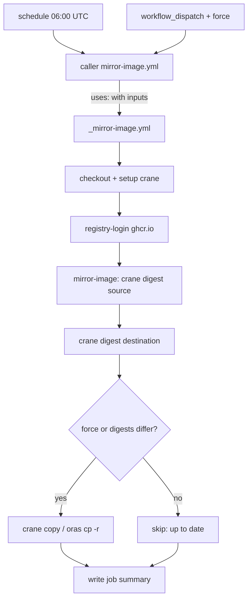

# Image mirror workflows architecture

This document describes the architecture of the GitHub Actions workflows that
mirror upstream container base images from Docker Hub into the GitHub Container
Registry (GHCR). It covers three questions:

1. [How are the actions structured?](#how-are-the-actions-structured)
2. [What tooling is used?](#what-tooling-is-used)
3. [What functionality is implemented — and what is not?](#what-functionality-is-implemented-and-what-is-not)

For naming and file-system conventions, see
[workflow naming conventions](../../contributing/workflow-naming.md).

## Purpose

The mirror workflows keep a private, controlled copy of a set of upstream base
images fresh inside GHCR. Each upstream image is copied into a `quarantine/<image>`
repository (for example `ghcr.io/<owner>/quarantine/python`), establishing a
stable, owner-controlled source that downstream application builds can depend on
rather than pulling directly from Docker Hub.

## How are the actions structured

The mirror workflows follow a **caller + reusable workflow** pattern, and the
reusable workflow is in turn assembled from small, single-purpose **composite
actions** under [`.github/actions/`](../../../.github/actions/) (see the
[action catalogue](../../reference/workflow-actions.md)). All shared logic lives
in the composite actions; the reusable workflow orchestrates them, and each
mirrored image gets a thin caller workflow that only supplies configuration.

```text
.github/
├── actions/                 # composite actions (reusable steps)
│   ├── registry-login/
│   └── mirror-image/
└── workflows/
    ├── _mirror-image.yml     # reusable workflow — orchestrates the actions
    ├── mirror-python.yml     # caller — docker.io/library/python  → quarantine/python
    ├── mirror-node.yml       # caller — docker.io/library/node    → quarantine/node
    └── mirror-openjdk.yml    # caller — docker.io/library/openjdk → quarantine/openjdk
```

### Reusable workflow (`_mirror-image.yml`)

[`_mirror-image.yml`](../../../.github/workflows/_mirror-image.yml) is an
internal workflow (the leading underscore marks it as "do not run directly").
It is triggered only through `workflow_call` and exposes these inputs:

| Input | Required | Default | Description |
| ----- | -------- | ------- | ----------- |
| `source_image` | yes | — | Fully qualified source image without tag (e.g. `docker.io/library/python`). |
| `source_tag` | yes | — | Source image tag to mirror (e.g. `3.14-slim`). |
| `dest_image` | yes | — | Fully qualified destination image without tag (e.g. `ghcr.io/<owner>/quarantine/python`). |
| `dest_tag` | yes | — | Destination image tag. |
| `force` | no | `false` | Copy even when the source and destination digests match. |
| `source_login_registry` | no | `""` | Registry to authenticate to before pulling the source (e.g. `dhi.io`). Empty means an anonymous public pull. |
| `copy_referrers` | no | `false` | Also copy OCI referrer artifacts (SBOMs, provenance, VEX, signatures) attached to the image. Switches the copy to `oras`. Works for any image that has referrers, not just hardened images. |

It also accepts two optional secrets, used only for authenticated sources:

| Secret | Required | Description |
| ------ | -------- | ----------- |
| `source_registry_username` | no | Username for `source_login_registry`. Required only when `source_login_registry` is set. |
| `source_registry_password` | no | Password/PAT for `source_login_registry`. Required only when `source_login_registry` is set. |

It defines a single `mirror` job that runs on `ubuntu-latest` with the minimal
permissions `contents: read` and `packages: write`, and performs these steps:

1. **Check out actions** — checks out the repository so the local composite
   actions are available.
2. **Set up crane** — installs the `crane` CLI.
3. **Set up oras** — installs `oras`, only when `copy_referrers` is `true`.
4. **Log in to source registry** (`registry-login`) — only when
   `source_login_registry` is set (e.g. Docker Hardened Images on `dhi.io`);
   authenticates `crane` (and `oras` when copying referrers).
5. **Log in to GHCR** (`registry-login`) — authenticates to `ghcr.io` using the
   built-in `GITHUB_TOKEN` and the triggering actor.
6. **Mirror image** (`mirror-image`) — the core idempotent-sync logic
   (described below). When `copy_referrers` is `true` the copy uses
   `oras cp -r` for the index and each per-platform child manifest so the
   attached referrers travel with the image; otherwise it uses `crane copy`.
7. **Write job summary** — renders the copied / up-to-date outcome from the
   `mirror-image` outputs.

### Caller workflows (`mirror-<image>.yml`)

Each caller — for example
[`mirror-python.yml`](../../../.github/workflows/mirror-python.yml),
[`mirror-node.yml`](../../../.github/workflows/mirror-node.yml), and
[`mirror-openjdk.yml`](../../../.github/workflows/mirror-openjdk.yml) — contains
no shell logic. A caller only declares:

- **Triggers** — a daily `schedule` (06:00 UTC) and a manual `workflow_dispatch`
  with an optional `force` boolean input.
- **Concurrency** — a per-image group (e.g. `mirror-quarantine-python`) with
  `cancel-in-progress: false`, so two runs of the same image never overlap while
  different images run independently.
- **Permissions** — `contents: read`, `packages: write`.
- **A single job** that calls `./.github/workflows/_mirror-image.yml` via `uses:`
  and passes the image-specific inputs.

The `force` input is wired through only on manual runs:

```yaml
force: ${{ github.event_name == 'workflow_dispatch' && inputs.force || false }}
```

This structure means adding a new mirror is a copy-and-edit operation on a caller
file with no logic changes — the reusable workflow does all the work.

### Control flow



## What tooling is used

| Tool | Role |
| ---- | ---- |
| **GitHub Actions** | Orchestration: scheduling, manual dispatch, reusable-workflow composition, concurrency control, and job summaries. |
| **[`crane`](https://github.com/google/go-containerregistry/blob/main/cmd/crane/README.md)** | Registry client used for all image operations — `crane digest` to read manifest digests and `crane copy` to transfer images. |
| **[`oras`](https://oras.land)** | Used only when `copy_referrers` is enabled, to copy the image together with its OCI referrer artifacts (`oras cp -r`). |
| **[`imjasonh/setup-crane`](https://github.com/imjasonh/setup-crane)** | Action that installs `crane` on the runner. It is pinned to a commit SHA (`31b88ef…`, v0.4) for supply-chain safety. |
| **`GITHUB_TOKEN`** | The built-in, automatically scoped token used to authenticate to GHCR with `packages: write`. No long-lived registry secrets are required. |
| **Bash** (`set -euo pipefail`) | The digest-compare-and-copy step is a single defensive shell script. |
| **`ubuntu-latest` runner** | GitHub-hosted runner the job executes on. |

Key tooling characteristics:

- **`crane copy` preserves multi-architecture manifest lists**, so mirrored
  images keep all their original platforms rather than collapsing to one.
- **Anonymous Docker Hub pulls.** Public Docker Hub source images are read
  without credentials; only the GHCR destination requires authentication.
- **Pinned third-party action.** The only external action is pinned by SHA,
  reducing the risk of a compromised tag.

## What functionality is implemented and what is not

### Implemented

- **Idempotent digest-based sync.** Each run reads the source digest with
  `crane digest`, reads the destination digest (treating a missing destination as
  empty), and copies only when the two differ — avoiding redundant transfers.
- **Multi-architecture preservation** via `crane copy`.
- **Optional referrer copying.** When `copy_referrers` is enabled the mirror
  copies the image together with its OCI referrer artifacts — SBOMs, provenance,
  VEX statements, and signatures — using `oras cp -r` for the index and each
  per-platform child manifest. This is what lets downstream SBOM-based scanning
  read attestations straight from quarantine. It works for any image that has
  referrers, not just Docker Hardened Images.
- **Authenticated sources.** Setting `source_login_registry` (plus the
  `source_registry_username` / `source_registry_password` secrets) lets the
  mirror pull from private or non–Docker Hub upstreams such as `dhi.io`. Public
  sources leave it empty and pull anonymously.
- **Scheduled refresh.** A daily cron (06:00 UTC) checks upstream for changes.
- **Manual runs with force.** `workflow_dispatch` allows on-demand execution, and
  the optional `force` input copies even when digests already match (useful for
  re-seeding or recovering a destination).
- **Concurrency safety.** Per-image concurrency groups prevent overlapping runs
  of the same mirror.
- **Least-privilege auth.** Only the built-in `GITHUB_TOKEN` with
  `contents: read` + `packages: write` is used; no static registry secrets.
- **Run summaries.** Each run writes a Markdown summary to
  `GITHUB_STEP_SUMMARY` reporting whether the image was up to date or copied,
  including the previous and new digests.
- **DRY, single-source-of-truth logic.** All behavior lives in one reusable
  workflow; per-image callers are configuration only.

### Not implemented (deliberately out of scope)

- **No image scanning or vulnerability gating.** Despite the `quarantine/`
  naming, the workflows do not scan images or block copying based on CVEs,
  policy, or signatures — they perform a straight mirror.
- **No signing or attestation generation.** Mirrored images are not signed (e.g.
  cosign) and no new provenance/SBOM attestations are produced or verified. When
  `copy_referrers` is enabled, existing referrers (including the upstream's
  SBOMs and signatures) are copied verbatim but are not re-verified.
- **No automatic tag discovery.** Each workflow mirrors one explicitly pinned
  source tag (e.g. `python:3.14-slim`). New tags or floating/`latest` tags are
  not discovered or tracked automatically; updating a tag is a manual edit to the
  caller.
- **No deletion / retention management.** Stale or superseded tags in GHCR are
  never pruned; the workflows only add or update.
- **No build step.** These workflows only mirror base images. Building the
  application images under `apps/` on top of those bases is handled separately by
  planned `build-<app>.yml` workflows.
- **No notification/alerting.** Failures surface only through the normal GitHub
  Actions run status and step summary; there is no integrated alerting.

## Adding a new mirror

1. Copy an existing caller such as `mirror-python.yml` to `mirror-<image>.yml`.
2. Update the display `name:`, the `concurrency.group`, and the four inputs
   (`source_image`, `source_tag`, `dest_image`, `dest_tag`).
3. No logic changes are needed — the reusable workflow handles the sync.
