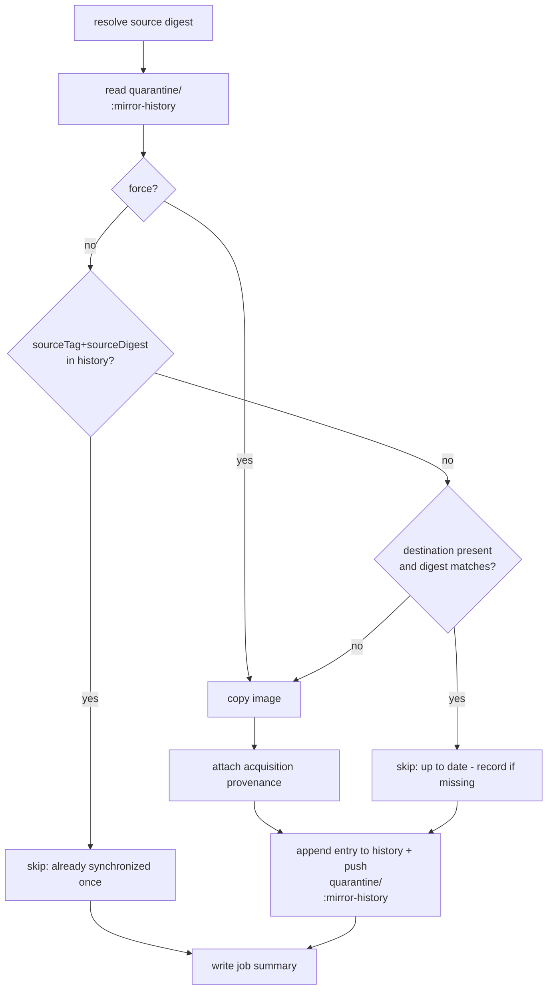

# Mirror history: skip re-synchronizing already-mirrored digests

- **Status:** implemented on branch `feature/mirror-history` (pending end-to-end validation)
- **Tracking issue:** [#157](https://github.com/toddysm/cssc-framework/issues/157)
- **Stage:** Acquire

This document describes the durable **mirror history** that lets the image-mirror workflows
stop re-synchronizing a digest they have already acquired once — even after that
digest has been promoted out of quarantine and deleted.

## Problem

The mirror is **stateless**. The [`mirror-image`](../../reference/workflow-actions.md)
action decides whether to copy by comparing two live values:

1. the **source** manifest digest (`crane digest docker.io/library/python:3.14-slim`), and
2. the **destination** digest (`crane digest ghcr.io/<owner>/quarantine/python:3.14-slim`).

It copies when they differ, treating a missing destination as "differs".

That works while the destination sticks around, but the acquisition pipeline
deliberately removes it:

1. The mirror copies `docker.io/library/python:3.14-slim` → `quarantine/python:3.14-slim`.
2. A promote-from-quarantine workflow copies it to `golden/python` and then
   **deletes the tag from quarantine**.
3. Deleting the *last* tagged version of a GHCR package deletes the whole
   `quarantine/python` package (documented GHCR behaviour; see the
   [delete-image](../../reference/workflow-actions.md) action, which already has to
   work around it).
4. The next scheduled mirror run reads the destination digest, finds **nothing**,
   concludes "differs", and **re-synchronizes the exact digest that was already
   acquired and promoted**. The image loops back into the pipeline.

The system has no memory that this digest was already handled.

## Goal

Give the mirror a durable, deletion-surviving record of the digests it has
already synchronized for a given source tag, and skip copying a digest that is
already recorded — while preserving every existing behaviour (`force`,
`copy_referrers`, acquisition provenance, multi-arch, concurrency safety).

Non-goals: pruning quarantine, discovering new tags, scanning, or changing the
promotion workflows.

## Approach: a `mirror-history` OCI artifact per synchronized repo

Store the history as a small OCI artifact in **each synchronized repo**, under a
reserved tag:

```
ghcr.io/<owner>/quarantine/<image>:mirror-history
```

The artifact carries a single JSON blob — an **append-only log** of every source
digest that has been synchronized, keyed by source tag.

Why a **separate tag in the same repo** (rather than a referrer or a sibling
repo):

- **It survives image deletion.** OCI referrers are attached to a subject digest
  and are orphaned/removed when that image is deleted; a standalone tag is not.
- **It keeps the package alive.** Because `mirror-history` is always present, the
  quarantine package is never reduced to zero tagged versions, so promotion's
  tag delete no longer trips the GHCR "cannot delete the last tagged version →
  whole package deleted" edge case. The history and the package persist together.
- **It is colocated**, matching the requirement that history live "in each repo
  that is synchronized", and it is trivially discoverable (`crane manifest
  quarantine/python:mirror-history`).

### Artifact format

An OCI **image manifest** (artifact) with one JSON blob layer:

- **manifest artifactType:** `application/vnd.cssc.mirror-history.v1+json`
  (pushed with `oras push --artifact-type`, so the manifest uses the standard
  empty config `application/vnd.oci.empty.v1+json`).
- **layer mediaType:** `application/vnd.cssc.mirror-history.v1+json`
- **manifest annotations** (for `oras discover`/`crane manifest` visibility):
  - `org.opencontainers.image.title=mirror-history.json`
  - `com.toddysm.mirror-history.count=<total entries>`
  - `com.toddysm.mirror-history.updated=<RFC3339>`

The blob is the history document:

```json
{
  "schemaVersion": 1,
  "image": "ghcr.io/toddysm/quarantine/python",
  "source": "docker.io/library/python",
  "entries": [
    {
      "sourceTag": "3.14-slim",
      "sourceDigest": "sha256:aaaa1111...",
      "destTag": "3.14-slim",
      "syncedAt": "2026-07-30T06:00:00Z",
      "runUrl": "https://github.com/toddysm/cssc-framework/actions/runs/123",
      "runId": "123",
      "runAttempt": "1",
      "force": false
    },
    {
      "sourceTag": "3.14-slim",
      "sourceDigest": "sha256:bbbb2222...",
      "destTag": "3.14-slim",
      "syncedAt": "2026-08-13T06:00:00Z",
      "runUrl": "https://github.com/toddysm/cssc-framework/actions/runs/456",
      "runId": "456",
      "runAttempt": "1",
      "force": false
    },
    {
      "sourceTag": "3.13-slim",
      "sourceDigest": "sha256:cccc3333...",
      "destTag": "3.13-slim",
      "syncedAt": "2026-08-13T06:01:00Z",
      "runUrl": "https://github.com/toddysm/cssc-framework/actions/runs/457",
      "runId": "457",
      "runAttempt": "1",
      "force": true
    }
  ]
}
```

The first two entries (same `sourceTag`, different `sourceDigest`) are the common
case: upstream re-pointed `3.14-slim` to a new digest, so both were mirrored once
and both are recorded. A different tag (`3.13-slim`) lives in the same log.

### Field reference

| Field | Meaning |
| ----- | ------- |
| `schemaVersion` | Integer, currently `1`. Lets the format evolve. |
| `image` | Destination repo the history belongs to. |
| `source` | Upstream source image (without tag). |
| `entries[]` | Append-only list; never pruned (unbounded). Ordered chronologically, oldest first. |
| `entries[].sourceTag` | Source tag that was mirrored. Half of the dedupe key. |
| `entries[].sourceDigest` | Source manifest digest. A match on `(sourceTag, sourceDigest)` means "already synchronized". Because the copy preserves digests, this is also the destination digest. |
| `entries[].destTag` | Tag written in quarantine. |
| `entries[].syncedAt` | RFC 3339 UTC timestamp of the sync. |
| `entries[].runUrl` / `runId` / `runAttempt` | Workflow run that performed the sync (audit trail + the dashboard's run link). |
| `entries[].force` | `true` when this sync was a `force` run (bypassed the history check). |

**Locked schema decisions:**

- **No separate `destDigest` field** — the copy preserves digests, so `sourceDigest`
  is also the destination digest; storing it twice would be redundant.
- **`force` appends a new entry** even when the same `(sourceTag, sourceDigest)`
  is already recorded, so the log stays a complete, ordered audit trail rather
  than mutating past entries.
- **Chronological order** — new entries are appended to the end (oldest → newest);
  consumers (e.g. the dashboard) sort/reverse as needed.

- **History key** = `(sourceTag, sourceDigest)`. A digest is "already
  synchronized" when an entry exists with the same `sourceTag` **and**
  `sourceDigest`. Scoping by source tag means that if two tags happen to point at
  the same digest they are tracked independently, and a tag that upstream
  re-points to a brand-new digest is (correctly) treated as new work.
- **Append-only, unbounded.** Entries are never removed; the log is the audit
  trail of everything the mirror has ever acquired for that repo.

### Changed mirror control flow



Key points:

- The **history check is a new short-circuit** that fires precisely in the case
  the current digest compare misses: the source digest is known but the
  destination is absent (promoted + deleted).
- The **existing digest short-circuit is kept** for the common "destination still
  present and unchanged" case. If that path finds the destination up to date but
  the digest is *not yet in the history* (e.g. first run after this feature
  ships), it records it so future runs are covered.
- **`force`** skips the history check and copies, then **still records** the
  digest (so the history stays a complete record).
- History is **read-modify-write**. The per-image concurrency group already
  guarantees runs of the same image never overlap
  (`cancel-in-progress: false`), so there is no race on the artifact.
- **`copy_referrers`** today always re-copies (referrers can change
  independently of the subject digest). Under this design a **recorded digest
  also suppresses the referrer re-copy**: once `(sourceTag, sourceDigest)` is in
  the history the mirror skips, even when `copy_referrers` is true. This trades
  routine referrer-freshness re-syncs for not re-pulling a promoted-and-deleted
  image; a `force` run is the escape hatch when referrers must be refreshed
  (resolved O2).

### Where the logic lives

- New composite action **`mirror-history`** under `.github/actions/mirror-history/`
  with two operations:
  - `check` — given repo + source tag + source digest, output
    `already-synchronized=true|false`.
  - `record` — append an entry and push the updated `:mirror-history` artifact
    (create it on first use).
  Uses `oras`/`crane` already available on the runner.
- `_mirror-image.yml` wires it in: a **check** step before `mirror-image` (gates
  the copy) and a **record** step after a successful copy. The `mirror-image`
  action itself is unchanged; gating happens at the workflow level via an `if:`
  on the mirror step (or a new `skip` input), keeping the action single-purpose.

## Interaction with existing behaviour

| Concern | Behaviour |
| ------- | --------- |
| Acquisition provenance | Unchanged. Still attached only when a copy happened and the digest changed. A history-skip means no copy, so no new provenance — correct. |
| `force` | Bypasses history check, copies, records. |
| `copy_referrers` | A recorded digest suppresses the re-copy too (skips); an unrecorded digest copies with `oras` and records. `force` refreshes referrers on demand. |
| Multi-arch | Unaffected; history keys on the index/source digest. |
| Concurrency | Per-image group already serializes runs → safe read-modify-write. |
| Promotion / delete-image | Benefits: the `mirror-history` tag keeps the package alive, avoiding the last-tagged-version delete workaround. No change required in promote workflows. |
| Dashboard | Extended: the Acquisition view surfaces a per-repo **synchronized history** read from the `:mirror-history` artifact, and excludes the reserved `mirror-history` tag when deciding whether an image is actually present in quarantine (see [Dashboard integration](#dashboard-integration)). |

## Dashboard integration

Rather than hide the persisted package, the CSSC Dashboard's **Acquisition** view
is extended to *surface* what each repo has already synchronized (this resolves
O1).

- **Read the history.** `packages-service` gains a capability to fetch and parse
  the `:mirror-history` artifact for a `quarantine/<image>` repo: resolve the
  `mirror-history` tag manifest, read its single JSON layer blob, and return the
  parsed `entries` (source tag, source digest, dest tag, `syncedAt`, run URL). It
  reads the registry (GHCR v2) blob, not just the Packages API, since the entries
  live in the artifact body. A new endpoint (e.g. `GET /packages/{name}/history`)
  exposes it.
- **Correct the "in quarantine" signal.** The reserved `mirror-history` tag is
  excluded when determining whether an image is actually present in quarantine,
  so a history-only package (image already promoted and deleted) is no longer
  shown as if an image were still awaiting promotion.
- **Render per repo.** Each Acquisition card shows, alongside its promotion
  issues, a **Synchronized** list: the source tags/digests already mirrored (with
  timestamp and run link), so it is clear what has flowed through the repo even
  after the image itself has left quarantine.

The access model is unchanged: only the outbound GitHub/registry read is
authenticated (the existing `read:packages` token); no new inbound auth.

## Open questions for review

_All design questions are currently resolved — see below._

### Resolved

- **O1 — Dashboard visibility.** Resolved: **surface, don't hide**. The dashboard
  is extended to read the `:mirror-history` artifact and show a per-repo
  synchronized history, and to exclude the reserved tag from the "in quarantine"
  signal (see [Dashboard integration](#dashboard-integration)).
- **O2 — `copy_referrers` + history.** Resolved: a recorded digest **also
  suppresses** the referrer re-copy (skip once recorded); `force` refreshes
  referrers on demand.
- **O3 — Bootstrapping.** Resolved: **no seeding**. Images mirrored+promoted
  before this ships will re-mirror once (no history yet) and then record — this is
  acceptable.
- **O4 — Reserved tag.** Resolved: the reserved tag name `mirror-history` is
  confirmed and will be documented as never a valid upstream tag to mirror.

## Deliverables (once approved)

1. `mirror-history` composite action (`check` + `record`).
2. `_mirror-image.yml` wiring (check before copy, record after).
3. Dashboard integration: a `packages-service` history read + endpoint, and the
   Acquisition view surfacing per-repo synchronized history (and excluding the
   reserved tag from the "in quarantine" signal).
4. Reference + architecture docs (this doc finalized, action catalogue entry, a
   `mirror-history` reference page, acquire index link).
5. End-to-end validation: mirror → promote → delete → re-run mirror shows
   **skipped (already synchronized)** instead of re-copy.
