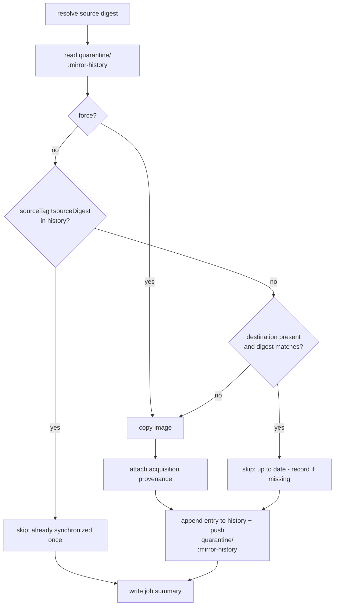

# Mirror history: skip re-synchronizing already-mirrored digests

- **Status:** proposed (design under review)
- **Tracking issue:** [#157](https://github.com/toddysm/cssc-framework/issues/157)
- **Stage:** Acquire

This document proposes a durable **mirror history** so the image-mirror workflows
stop re-synchronizing a digest they have already acquired once — even after that
digest has been promoted out of quarantine and deleted.

## Problem

The mirror is **stateless**. The [`mirror-image`](../../reference/workflow-actions.md)
action decides whether to copy by comparing two live values:

1. the **source** manifest digest (`crane digest docker.io/library/python:3.14-slim`), and
2. the **destination** digest (`crane digest ghcr.io/<owner>/quarantine/python:3.14-slim`).

It copies when they differ, treating a missing destination as "differs".

That works while the destination sticks around, but the acquisition pipeline
deliberately removes it:

1. The mirror copies `docker.io/library/python:3.14-slim` → `quarantine/python:3.14-slim`.
2. A promote-from-quarantine workflow copies it to `golden/python` and then
   **deletes the tag from quarantine**.
3. Deleting the *last* tagged version of a GHCR package deletes the whole
   `quarantine/python` package (documented GHCR behaviour; see the
   [delete-image](../../reference/workflow-actions.md) action, which already has to
   work around it).
4. The next scheduled mirror run reads the destination digest, finds **nothing**,
   concludes "differs", and **re-synchronizes the exact digest that was already
   acquired and promoted**. The image loops back into the pipeline.

The system has no memory that this digest was already handled.

## Goal

Give the mirror a durable, deletion-surviving record of the digests it has
already synchronized for a given source tag, and skip copying a digest that is
already recorded — while preserving every existing behaviour (`force`,
`copy_referrers`, acquisition provenance, multi-arch, concurrency safety).

Non-goals: pruning quarantine, discovering new tags, scanning, or changing the
promotion workflows.

## Approach: a `mirror-history` OCI artifact per synchronized repo

Store the history as a small OCI artifact in **each synchronized repo**, under a
reserved tag:

```
ghcr.io/<owner>/quarantine/<image>:mirror-history
```

The artifact carries a single JSON blob — an **append-only log** of every source
digest that has been synchronized, keyed by source tag.

Why a **separate tag in the same repo** (rather than a referrer or a sibling
repo):

- **It survives image deletion.** OCI referrers are attached to a subject digest
  and are orphaned/removed when that image is deleted; a standalone tag is not.
- **It keeps the package alive.** Because `mirror-history` is always present, the
  quarantine package is never reduced to zero tagged versions, so promotion's
  tag delete no longer trips the GHCR "cannot delete the last tagged version →
  whole package deleted" edge case. The history and the package persist together.
- **It is colocated**, matching the requirement that history live "in each repo
  that is synchronized", and it is trivially discoverable (`crane manifest
  quarantine/python:mirror-history`).

### Artifact format

An OCI **image manifest** (artifact) with a custom config media type and one
JSON blob layer:

- **manifest artifactType / config mediaType:** `application/vnd.cssc.mirror-history.v1+json`
- **layer mediaType:** `application/vnd.cssc.mirror-history.v1+json`
- **manifest annotations** (for `oras discover`/`crane manifest` visibility):
  - `org.opencontainers.image.title=mirror-history.json`
  - `com.toddysm.mirror-history.count=<total entries>`
  - `com.toddysm.mirror-history.updated=<RFC3339>`

The blob is the history document:

```json
{
  "schemaVersion": 1,
  "image": "ghcr.io/<owner>/quarantine/python",
  "source": "docker.io/library/python",
  "entries": [
    {
      "sourceTag": "3.14-slim",
      "sourceDigest": "sha256:<source-manifest-digest>",
      "destTag": "3.14-slim",
      "syncedAt": "2026-07-30T06:00:00Z",
      "runUrl": "https://github.com/<owner>/cssc-framework/actions/runs/<id>",
      "runId": "<id>",
      "runAttempt": "1",
      "force": false
    }
  ]
}
```

- **History key** = `(sourceTag, sourceDigest)`. A digest is "already
  synchronized" when an entry exists with the same `sourceTag` **and**
  `sourceDigest`. Scoping by source tag means that if two tags happen to point at
  the same digest they are tracked independently, and a tag that upstream
  re-points to a brand-new digest is (correctly) treated as new work.
- **Append-only, unbounded.** Entries are never removed; the log is the audit
  trail of everything the mirror has ever acquired for that repo.

### Changed mirror control flow



Key points:

- The **history check is a new short-circuit** that fires precisely in the case
  the current digest compare misses: the source digest is known but the
  destination is absent (promoted + deleted).
- The **existing digest short-circuit is kept** for the common "destination still
  present and unchanged" case. If that path finds the destination up to date but
  the digest is *not yet in the history* (e.g. first run after this feature
  ships), it records it so future runs are covered.
- **`force`** skips the history check and copies, then **still records** the
  digest (so the history stays a complete record).
- History is **read-modify-write**. The per-image concurrency group already
  guarantees runs of the same image never overlap
  (`cancel-in-progress: false`), so there is no race on the artifact.
- **`copy_referrers`** currently always re-copies (referrers can change
  independently of the subject digest). Under this design the history check is
  **skipped when `copy_referrers` is true as well**, preserving today's behaviour
  — referrer freshness cannot be inferred from the source digest alone. (Open
  question O2 below asks whether we instead want history to suppress referrer
  re-copy once recorded.)

### Where the logic lives

- New composite action **`mirror-history`** under `.github/actions/mirror-history/`
  with two operations:
  - `check` — given repo + source tag + source digest, output
    `already-synchronized=true|false`.
  - `record` — append an entry and push the updated `:mirror-history` artifact
    (create it on first use).
  Uses `oras`/`crane` already available on the runner.
- `_mirror-image.yml` wires it in: a **check** step before `mirror-image` (gates
  the copy) and a **record** step after a successful copy. The `mirror-image`
  action itself is unchanged; gating happens at the workflow level via an `if:`
  on the mirror step (or a new `skip` input), keeping the action single-purpose.

## Interaction with existing behaviour

| Concern | Behaviour |
| ------- | --------- |
| Acquisition provenance | Unchanged. Still attached only when a copy happened and the digest changed. A history-skip means no copy, so no new provenance — correct. |
| `force` | Bypasses history check, copies, records. |
| `copy_referrers` | History check skipped (as today it always re-copies); still records. |
| Multi-arch | Unaffected; history keys on the index/source digest. |
| Concurrency | Per-image group already serializes runs → safe read-modify-write. |
| Promotion / delete-image | Benefits: the `mirror-history` tag keeps the package alive, avoiding the last-tagged-version delete workaround. No change required in promote workflows. |
| Dashboard (`packages-service`) | Trade-off: after promotion+delete the `quarantine/<image>` package now persists (holding only `:mirror-history`). The dashboard may show a quarantine repo with no image tags. See open question O1. |

## Open questions for review

- **O1 — Dashboard visibility.** Keeping the package alive means quarantine repos
  no longer vanish when emptied. Do we (a) accept it, (b) have the dashboard hide
  the reserved `mirror-history` tag / treat a history-only package as empty, or
  (c) move history to a sibling `quarantine-history/<image>` repo after all?
- **O2 — `copy_referrers` + history.** Should a recorded digest also suppress the
  referrer re-copy, or keep always-re-copy for referrer freshness?
- **O3 — Bootstrapping.** For images already mirrored+promoted before this ships,
  the first run will re-mirror once (no history yet) and then record. Acceptable,
  or do we seed history from existing acquisition-provenance referrers?
- **O4 — Reserved-tag collisions.** `mirror-history` must never be a real upstream
  tag we mirror. Confirm the reserved name and document it.

## Deliverables (once approved)

1. `mirror-history` composite action (`check` + `record`).
2. `_mirror-image.yml` wiring (check before copy, record after).
3. Reference + architecture docs (this doc finalized, action catalogue entry, a
   `mirror-history` reference page, acquire index link).
4. End-to-end validation: mirror → promote → delete → re-run mirror shows
   **skipped (already synchronized)** instead of re-copy.
