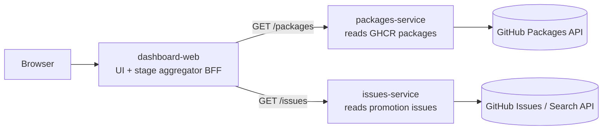
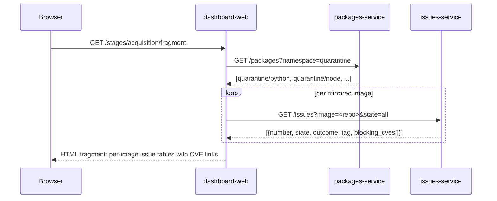

# CSSC Dashboard application architecture

This document describes the architecture of the **CSSC Dashboard** — a
demonstration web application that visualizes the
[Containers Secure Supply Chain (CSSC) framework](https://aka.ms/cssc/framework)
stage by stage, sourcing its data from this repository's GitHub Container
Registry (GHCR) packages and promotion tracking issues.

It covers:

1. [Purpose](#purpose)
2. [Goals and non-goals](#goals-and-non-goals)
3. [High-level architecture](#high-level-architecture)
4. [Service decomposition](#service-decomposition)
5. [Stage extensibility model](#stage-extensibility-model)
6. [Acquisition stage](#acquisition-stage)
7. [API contracts](#api-contracts)
8. [Data model](#data-model)
9. [Configuration](#configuration)
10. [Security considerations](#security-considerations)
11. [Deployment](#deployment)
12. [Local development](#local-development)
13. [Repository layout](#repository-layout)
14. [Future work](#future-work)
15. [Implementation plan](#implementation-plan)

## Purpose

The mirror and promote-from-quarantine workflows already move upstream base
images through a `quarantine/<image>` → `golden/<image>` pipeline, opening
GitHub tracking issues when an image is blocked by its vulnerability gate. That
machinery is operational but invisible: there is no single place to *see* the
state of the supply chain.

The CSSC Dashboard provides that view. It is a **read-only**, demonstration web
application that presents the supply chain **one CSSC stage at a time**, starting
with the **Acquisition** stage. It is intentionally small so the security
mechanics — not the application code — stay front and center, and it is built as
a set of independently scalable microservices so the same capabilities can be
reused as additional stages are added.

## Goals and non-goals

### Goals

- Present the CSSC framework as a set of **stages**, with a section per stage and
  a model that is **extensible** to new stages without rewriting the UI.
- Ship the **Acquisition** stage first: list the mirrored images and, per image,
  the promotion tracking issues and the CVEs each issue is blocked on.
- Decompose back-end capabilities into **independent microservices** that can be
  reused by future stages and scaled independently on Kubernetes.
- Be **read-only** over GitHub data — the dashboard never mutates packages or
  issues.

### Non-goals

- Not a production system; no authentication/authorization for end users in this
  iteration (it is a demo, deployed behind whatever the cluster provides).
- Does not write to, gate, or approve promotions — that remains the job of the
  GitHub Actions workflows.
- Does not scan images itself; it reads the results already recorded by the
  promote-from-quarantine workflows.

## High-level architecture

Three independently deployable, independently scalable services. The two
back-end services are **generic capabilities** (not Acquisition-specific) so
future stages can reuse them. The `dashboard-web` service is the user-facing
tier and acts as a backend-for-frontend (BFF) that aggregates the capability
services into stage views.



All services are written in **Python** with **FastAPI**. The two capability
services expose JSON APIs; `dashboard-web` additionally renders HTML with
**Jinja2** and uses **htmx** for progressive, fragment-based loading (no
JavaScript build step). Services communicate over Kubernetes `Service` DNS
names (`http://packages-service`, `http://issues-service`).

## Service decomposition

| Service | Type | Responsibility | Reused later by |
| ------- | ---- | -------------- | --------------- |
| `packages-service` | FastAPI JSON API | List GHCR container packages by namespace and their tags/digests. Caches GitHub responses. | Any stage needing image inventory (scan, sign, SBOM, deploy policy). |
| `issues-service` | FastAPI JSON API | Query promotion tracking issues by image/tag/label/state; parse the embedded `cssc-metadata` block (including `blocking_cves`). Caches responses. | Any stage with issue-driven gates or approvals. |
| `dashboard-web` | FastAPI + Jinja2/htmx | Stage registry and UI. Per stage, a provider calls the capability services and composes the view. | New stages add a provider; new capabilities add a microservice. |

Each service is independently deployable and owns its own `Dockerfile`,
`requirements.txt`, Helm chart, and tests. Each exposes `GET /healthz`
(liveness) and `GET /readyz` (readiness) and is horizontally scalable via an
HPA.

A small shared library, **`cssc_common`**, holds cross-cutting concerns — the
`httpx`-based GitHub HTTP client base, a TTL response cache, authentication
helpers, and shared Pydantic models — and is installed into each service. This
avoids duplication while keeping the services independently deployable.

## Stage extensibility model

`dashboard-web` owns a **stage registry**. A stage is described by a small
interface and a provider that knows how to produce that stage's data by calling
the capability services:

```text
Stage         { id, title, description, order }
StageProvider { stage: Stage; get_data() -> stage-specific payload }
```

- The index page renders **one collapsible section per registered stage**,
  ordered by `order`. Acquisition is `order: 1`.
- Adding a **new stage** = add a provider module under
  `dashboard-web/.../stages/`, register it, and supply a fragment template. No
  changes to existing stages or the navigation logic.
- Adding a **new capability** = add a new microservice (for example
  `scan-service`) plus its Helm subchart; a stage provider calls it. Existing
  services are untouched.

## Acquisition stage

The Acquisition stage answers: *what did we bring in from outside, and what is
blocking it from being promoted?*

- **Mirrored images** are the GHCR **container packages** under the
  `quarantine/*` namespace, populated by the `mirror-*` workflows. They are
  enumerated strictly through the GitHub **Packages API**
  (`packages-service`). This requires a token with `read:packages`.
- For each mirrored image, the dashboard lists the **promotion tracking
  issues** — both **open** (`promotion-pending`) and **closed**
  (`promotion-approved` / `promotion-denied`) — matched by the deterministic
  title `Promotion blocked: <image>:<tag>` and the embedded `cssc-metadata`
  JSON.
- The issues are rendered in a **table** with columns **Issue** (link), **Tag**,
  **State** (Open / Closed, with the approved/denied outcome), and **Blocking
  CVEs**.
- Each **CVE** is rendered as a hyperlink to a CVE database that opens in a new
  tab (`target="_blank" rel="noopener"`). The CVE base URL is configurable and
  defaults to `https://nvd.nist.gov/vuln/detail/<id>`.

### Acquisition data flow



## API contracts

These contracts are generic so other stages can reuse them.

### packages-service

| Method & path | Description | Response (shape) |
| ------------- | ----------- | ---------------- |
| `GET /packages?namespace=quarantine` | List container packages in a namespace. | `[{ name, visibility, updated_at, tag_count }]` |
| `GET /packages/{name}/tags` | List tags for a package. | `[{ tag, digest, updated_at }]` |
| `GET /healthz`, `GET /readyz` | Liveness / readiness. | `{ status }` |

### issues-service

| Method & path | Description | Response (shape) |
| ------------- | ----------- | ---------------- |
| `GET /issues?image=<repo>&tag=<tag>&state=all` | Promotion tracking issues filtered by image/tag/state. `image` and `tag` are optional filters. | `[{ number, title, url, state, outcome, image, tag, blocking_cves[] }]` |
| `GET /healthz`, `GET /readyz` | Liveness / readiness. | `{ status }` |

`outcome` is one of `pending`, `approved`, `denied`, derived from the issue
labels. `blocking_cves` is parsed from the `cssc-metadata` JSON block embedded
in the issue body by the `manage-issue` action.

### dashboard-web

| Method & path | Description |
| ------------- | ----------- |
| `GET /` | Full page: one section per registered stage. |
| `GET /stages/{id}/fragment` | htmx fragment for a stage (lazy-loaded). For `acquisition`: the per-image issue tables. |
| `GET /healthz`, `GET /readyz` | Liveness / readiness. |

## Data model

```text
MirroredImage { name, namespace, visibility, updated_at, tags[] }
Tag           { tag, digest, updated_at }
PromotionIssue{ number, title, url, state, outcome, image, tag, blocking_cves[] }
Cve           { id, url }   # url = CVE_BASE_URL + id
```

The authoritative source for `blocking_cves` is the `cssc-metadata` block the
promote-from-quarantine workflow writes into the issue body (delimited by
`<!-- cssc-metadata:start -->` / `<!-- cssc-metadata:end -->`), which contains a
JSON object with a `blocking_cves` array among other promotion parameters.

## Configuration

All configuration is environment-driven (Kubernetes `ConfigMap` + `Secret`).

| Service | Variable | Purpose |
| ------- | -------- | ------- |
| packages-service, issues-service | `GITHUB_TOKEN` | Token with `read:packages` and issues read. Supplied via `Secret`. |
| packages-service, issues-service | `GITHUB_OWNER`, `GITHUB_REPO` | Repository coordinates. |
| packages-service, issues-service | `CACHE_TTL_SECONDS` | Response cache TTL. |
| dashboard-web | `PACKAGES_SERVICE_URL`, `ISSUES_SERVICE_URL` | Upstream service DNS names. |
| dashboard-web | `QUARANTINE_NAMESPACE` | Namespace to treat as "mirrored" (default `quarantine`). |
| dashboard-web | `CVE_BASE_URL` | CVE link base, default `https://nvd.nist.gov/vuln/detail/`. |

## Security considerations

- The **GitHub token lives only in the two capability services**, never in
  `dashboard-web` and never sent to the browser.
- The dashboard is **read-only**; no endpoint mutates GitHub state.
- Outbound network access from the capability services is limited to the GitHub
  API host.
- CVE links are **plain anchor tags**; the server never fetches CVE pages, and
  links use `rel="noopener"`.
- Tokens are injected via `Secret`; non-secret config via `ConfigMap`.

## Deployment

An **umbrella Helm chart** under `apps/python-app/deploy/helm/` composes three
**subcharts** (one per service), each following the existing chart template
pattern in this repository (`deployment`, `service`, `hpa`, `ingress`, `pdb`,
`configmap`). The umbrella chart can deploy all three services together, while
each subchart remains independently installable.

## Local development

A `docker-compose` file plus a `Makefile` run the three services together for
local development, wiring `dashboard-web` to the two capability services and
reading the GitHub token from the local environment.

## Repository layout

The application lives under `apps/python-app/` (replacing the previous
placeholder skeleton):

```text
apps/python-app/
  services/
    packages-service/   # FastAPI JSON API — GHCR packages
      src/  tests/  Dockerfile  requirements.txt  deploy/helm/  README.md
    issues-service/     # FastAPI JSON API — promotion issues + cssc-metadata
      src/  tests/  Dockerfile  requirements.txt  deploy/helm/  README.md
    dashboard-web/      # FastAPI + Jinja2/htmx — stage registry + UI (BFF)
      src/  tests/  Dockerfile  requirements.txt  deploy/helm/  README.md
  libs/cssc_common/     # shared GitHub client, cache, auth, models
  deploy/helm/          # umbrella chart -> 3 subcharts
  README.md
```

## Future work

- Additional stages (Catalog, Build, Deploy, Run, Observability) as new
  providers in `dashboard-web`, reusing the existing capability services and
  adding new microservices (for example a `scan-service` or `sbom-service`) as
  needed.
- Surfacing golden-image promotion history and scan-report referrer artifacts.
- AI-artifact supply chain views (models, datasets) once those pipelines exist.

## Implementation plan

The work is tracked by a set of GitHub issues. Each task is sized to a single
focused pull request:

1. **`cssc_common` shared library** — GitHub HTTP client base, TTL cache, auth,
   shared models.
2. **`packages-service`** — FastAPI app, GHCR Packages client, routes, health,
   config, tests, Dockerfile, requirements.
3. **`issues-service`** — FastAPI app, Issues/Search client, `cssc-metadata`
   parser, routes, health, config, tests, Dockerfile, requirements.
4. **`dashboard-web`** — stage registry + base interfaces, Acquisition provider,
   capability-service clients, Jinja2/htmx UI, config, tests, Dockerfile,
   requirements.
5. **Helm charts** — umbrella chart plus per-service subcharts.
6. **Local development orchestration** — `docker-compose` and `Makefile`.
7. **Documentation** — application READMEs and links from the docs index.

See the CSSC Dashboard tracking issue (#98) for live status and links to each task.
