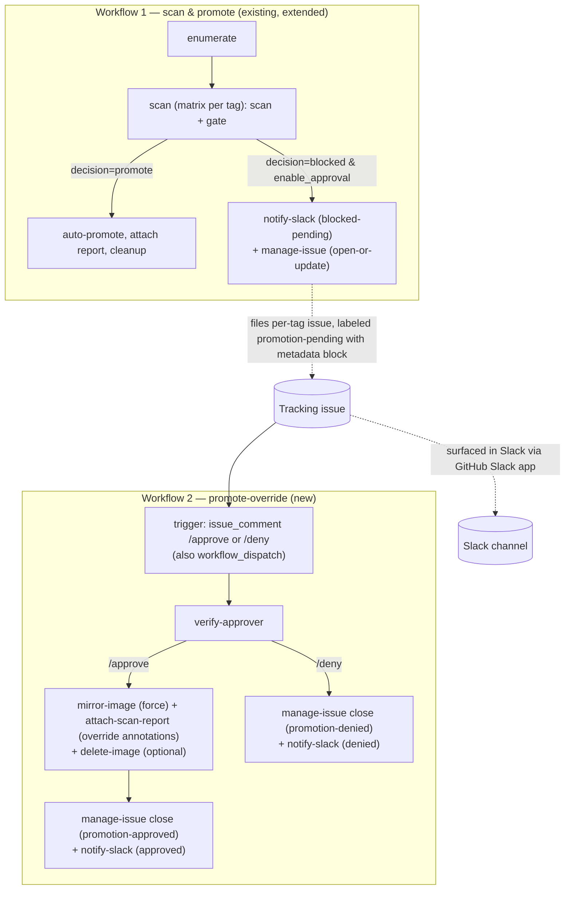

# Design proposal: human-in-the-loop override approval for blocked images

**Status:** Approved — implemented (see tracking issue #64)
**Scope:** Adds an optional manual-approval path that lets an authorized
maintainer promote a `quarantine/<image>` tag **despite** it failing the
vulnerability gate, with Slack notification and a GitHub issue as the audit
trail. Builds on the
[promote-from-quarantine workflows](promote-from-quarantine-workflows.md).

---

## 1. Problem statement

Today the promote-from-quarantine workflows scan each quarantine tag, apply a
severity threshold plus a CVE exception list, and **silently leave blocked
images in quarantine** — surfacing the outcome only in the run status and job
summary. There is no notification and no way to *consciously override* the gate
for a specific image without editing the exception list and re-running.

We want a deliberate, audited override path:

1. The scan-and-promote workflow runs.
2. A scanned image fails the threshold and is **blocked**.
3. The maintainer is **notified via Slack**, and a **GitHub issue is filed** for
   that image+tag.
4. The maintainer **approves or denies** the promotion.
5. **Deny** → no promotion; the issue is **closed** with the denial recorded.
6. **Approve** → the image is **promoted despite the failing gate**, the issue is
   closed as approved, and the promotion is recorded as a manual override in the
   image's provenance.

## 2. Decisions

| Decision | Choice | Rationale |
| -------- | ------ | --------- |
| Approval mechanism | **Two-workflow split** | Scan run ends green and holds no runner; the override can be approved hours or days later by a separate, decoupled workflow. |
| Granularity | **Per image+tag** | One tracking issue and one approve/deny decision per blocked tag, matching the existing per-tag matrix model. |
| Repo visibility | Public | No plan limitation; chosen path does not depend on environment required-reviewers. |
| Slack | **GitHub Slack app** for interaction + a reusable `notify-slack` action for rich custom alerts | The GitHub Slack app surfaces the tracking issue in Slack and supports commenting/closing from Slack; the action posts a formatted CVE alert. |

### 2.1 Approval surface (important)

The GitHub Slack app's **one-click approval button** is a feature of
**environment protection rules**, which the two-workflow split does *not* use.
With the split, the approval surface is an **issue-comment command** on the
per-tag tracking issue:

- Comment **`/approve`** to promote the image despite the failing gate.
- Comment **`/deny`** to reject the promotion and close the issue.

These comments can be posted from the GitHub web UI, GitHub mobile, **or from
Slack** via the GitHub Slack app's issue-comment support. If one-click Slack
approval buttons become a hard requirement later, switching the override gate to
a **GitHub Environment + required reviewers** is the migration path (noted in
section 7).

## 3. Architecture

The design follows the established **caller + reusable workflow + composite
action** pattern. Two new **reusable composite actions** are added for Slack and
issue handling, one for approver verification, and a new **reusable
override workflow** with a thin caller is introduced. The existing scan
workflows are extended (backward-compatibly) to fire the notification and open
the issue when an image is blocked.



### 3.1 The tracking issue is the source of truth

Because Workflow 2 may run long after Workflow 1 (in a separate run with no
shared state), all data needed to promote later is embedded in the issue body as
a **machine-readable fenced metadata block** (JSON), e.g.:

```json
{
  "source_repo": "ghcr.io/toddysm/quarantine/python",
  "dest_repo": "ghcr.io/toddysm/golden/python",
  "tag": "3.14-slim",
  "digest": "sha256:...",
  "threshold": "HIGH",
  "scanner": "trivy",
  "scanner_version": "0.71.0",
  "method": "image",
  "blocking_cves": ["CVE-2024-1234", "CVE-2024-5678"]
}
```

Workflow 2 reads this block back from the issue, so the issue is the single
source of truth for the override. Reruns of the scan workflow update the same
issue (deduped by label + deterministic title) instead of opening duplicates.

## 4. New reusable composite actions (`.github/actions/<verb-noun>/`)

These are the reusable building blocks (you asked specifically for reusable
actions). Each is a single-purpose composite action consistent with the existing
catalogue.

### 4.1 `notify-slack`
Posts a formatted (Block Kit) message to a Slack **incoming webhook**.

| Input | Required | Description |
| ----- | -------- | ----------- |
| `webhook-url` | yes | Slack incoming webhook URL (passed from the `slack_webhook` secret). |
| `status` | yes | `blocked-pending` \| `approved` \| `denied`. Selects the message template. |
| `image` | yes | Source repository (e.g. `ghcr.io/toddysm/quarantine/python`). |
| `tag` | yes | Image tag. |
| `threshold` | no | Severity threshold the image failed. |
| `blocking-cves` | no | Comma/space-separated CVE summary for the alert. |
| `issue-url` | no | Link to the tracking issue. |
| `run-url` | no | Link to the workflow run. |
| `approver` | no | Actor recorded for approved/denied messages. |

### 4.2 `manage-issue`
Wraps issue lifecycle operations via the GitHub REST API (`gh`/`GITHUB_TOKEN`,
`issues: write`).

| Input | Required | Description |
| ----- | -------- | ----------- |
| `operation` | yes | `open-or-update` \| `comment` \| `close`. |
| `image` | yes | Source repository (used for dedupe + metadata). |
| `tag` | yes | Image tag (used for dedupe + metadata). |
| `metadata-json` | for `open-or-update` | The machine-readable block embedded in the body. |
| `body` / `comment` | no | Human-readable body or comment text. |
| `outcome` | for `close` | `promotion-approved` \| `promotion-denied` (sets the closing label + comment). |
| `token` | yes | `GITHUB_TOKEN`. |

Behavior:
- **`open-or-update`** — idempotent. Dedupes by label `promotion-pending` plus a
  deterministic title (`Promotion blocked: <image>:<tag>`); creates the issue if
  none exists, otherwise updates the body/metadata and adds a comment. Applies
  labels `promotion-pending`, `image:<repo>`, `tag:<tag>`.
- **`comment`** — appends a comment.
- **`close`** — removes `promotion-pending`, applies the outcome label, posts a
  closing comment, and closes the issue.

Outputs: `issue-number`, `issue-url`, and (for the override workflow)
`metadata-json` parsed back out of an existing issue.

### 4.3 `verify-approver`
Security control. Confirms the commenter/actor has sufficient repository
permission before an override is honored.

| Input | Required | Description |
| ----- | -------- | ----------- |
| `actor` | yes | The login that issued the command. |
| `min-permission` | no | Minimum permission (default `maintain`; `admin`/`maintain`/`write`). |
| `token` | yes | `GITHUB_TOKEN`. |

Calls `GET /repos/{owner}/{repo}/collaborators/{actor}/permission` and fails the
step (sets output `authorized=false`) if the actor is below the threshold.

### 4.4 Extended action: `attach-scan-report`
Add override-provenance annotations so a promoted-despite-failing image carries
auditable proof. New optional inputs produce new annotations on the scan-report
referrer:

| Annotation | Example | Meaning |
| ---------- | ------- | ------- |
| `com.cssc.scan.override` | `true` | Image was promoted via manual override. |
| `com.cssc.scan.override-approver` | `toddysm` | Login that approved. |
| `com.cssc.scan.override-issue` | `https://github.com/.../issues/42` | Tracking issue. |
| `com.cssc.scan.override-cves` | `CVE-2024-1234\|CVE-2024-5678` | CVEs that were overridden. |

## 5. New / changed workflows

### 5.1 Extended — `_promote-from-quarantine.yml` and `_promote-from-quarantine-sbom.yml`
Backward-compatible additions:

- New inputs: `enable_approval` (bool, default `false`),
  and the existing severity/exception inputs unchanged.
- New optional secret: `slack_webhook`.
- When `enable_approval == true` and a tag's `decision == blocked`, the
  `scan` job persists the override metadata block as a per-tag artifact (it
  does **not** itself open issues). A dedicated `notify` job — the only job
  granted `issues: write` — then reads that artifact and runs `manage-issue`
  (`open-or-update`) and `notify-slack` (status `blocked-pending`). Keeping
  `issues: write` off the `scan` matrix preserves least privilege. No behavior
  change when `enable_approval` is `false` — existing callers are unaffected.

### 5.2 New reusable — `_promote-override.yml`
Performs the override promotion for a single image+tag.

Inputs: `source_repo`, `dest_repo`, `tag`, `issue_number`, `approver`,
`decision` (`approve`/`deny`), `trivy_version`, `method` (`image`/`sbom`).
Secret: `slack_webhook`, optional `ghcr_delete_token`.

Jobs/steps:
1. `verify-approver` — abort if the approver lacks permission.
2. On **approve**: `manage-issue` (read metadata) → `mirror-image` (`force: true`,
   `oras cp -r` for SBOM method) → `attach-scan-report` (override annotations) →
   `delete-image` (optional) → `manage-issue close` (`promotion-approved`) →
   `notify-slack` (approved).
3. On **deny**: `manage-issue close` (`promotion-denied`) → `notify-slack`
   (denied). No promotion.

### 5.3 New caller — `promote-override.yml`
Thin caller wiring triggers to `_promote-override.yml`.

- **Triggers:**
  - `issue_comment` (type `created`) — fires when a comment is added to an issue
    labeled `promotion-pending`. A small parse step extracts `/approve` or
    `/deny` and the image+tag from the issue, then calls the reusable workflow.
    (Runs the default-branch version of the workflow, so it is not
    attacker-controlled.)
  - `workflow_dispatch` — manual fallback: `image`, `tag`, `decision`.
- **Permissions:** `contents: read`, `packages: write`, `issues: write`.
- Forwards `slack_webhook` and `ghcr_delete_token` secrets.

## 6. Caller impact

Existing `promote-from-quarantine-<image>.yml` callers keep working unchanged.
To opt in to approvals, a caller sets `enable_approval: true` and passes the
`slack_webhook` secret. The new `promote-override.yml` is a single
repository-wide caller (one issue-comment listener), not per image.

## 7. Security considerations

- **Privileged override.** Promoting a failing image bypasses the security gate,
  so the override is gated by `verify-approver` (default `maintain`+). Anyone can
  comment, but only authorized logins are honored.
- **Trusted trigger.** `issue_comment` runs the workflow definition from the
  default branch, not from a PR branch, preventing workflow tampering.
- **Auditability.** Every override is recorded in (a) the closed issue, (b) the
  Slack channel, and (c) the image's scan-report referrer annotations.
- **Secret handling.** The Slack webhook is a repository/organization secret.
- **Migration to environments.** If native one-click Slack approval (or stronger
  audited gating) is later required, the override job can adopt a **GitHub
  Environment with required reviewers**; the `notify-slack`/`manage-issue`
  actions and the override-provenance annotations carry over unchanged.

## 8. Out of scope (unchanged)

No signing, no automatic remediation, no cross-scanner support, no `golden/`
retention policy. This proposal only adds the notify + approve/deny override
path.

## 9. Deliverables summary (for approval)

**Reusable composite actions**
- `notify-slack` (new)
- `manage-issue` (new)
- `verify-approver` (new)
- `attach-scan-report` (extended with override annotations)

**Workflows**
- `_promote-from-quarantine.yml` (extended: notify + open issue on block)
- `_promote-from-quarantine-sbom.yml` (extended: same)
- `_promote-override.yml` (new reusable override workflow)
- `promote-override.yml` (new caller: issue-comment + manual triggers)

**Docs**
- This design doc; on implementation, update
  [promote-from-quarantine-workflows.md](promote-from-quarantine-workflows.md),
  [workflow-actions.md](../../reference/workflow-actions.md), and
  [workflow-naming.md](../../contributing/workflow-naming.md).
