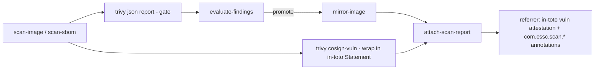

# Vulnerability-attestation scan report

> **Status: implemented.** The promote-from-quarantine scan-report referrer is
> a content-bearing in-toto vulnerability attestation (see the
> [scan-image](../../../.github/actions/scan-image/action.yml),
> [scan-sbom](../../../.github/actions/scan-sbom/action.yml), and
> [attach-scan-report](../../../.github/actions/attach-scan-report/action.yml)
> actions).

This document describes replacing the **empty** OCI scan-report referrer that
the promote-from-quarantine workflows attach today with a **content-bearing
vulnerability attestation** — an in-toto statement wrapping Trivy's own
vulnerability scan record — while keeping the human-readable
`com.cssc.scan.*` summary annotations on that same referrer manifest.

For the workflows this changes, see
[promote-from-quarantine workflows](promote-from-quarantine-workflows.md). For
the referrer conventions this follows, see
[image attestations](../../reference/image-attestations.md) and the
[action catalogue](../../reference/workflow-actions.md).

## Motivation

Every image promoted into `golden/<image>` (or `base/hardened/<image>`) gets an
OCI referrer recording *how and when it was cleared*. Today that referrer is an
**empty artifact** — a manifest with the standard empty config and **no layer
blobs** — carrying the decision only as annotations
(`com.cssc.scan.threshold`, `com.cssc.scan.exceptions`, scanner name/version,
etc.). See the
[scan-report referrer artifact](promote-from-quarantine-workflows.md#scan-report-referrer-artifact).

The annotations answer *"did it pass, and under what policy?"* but the actual
finding set — which CVEs Trivy saw, in which packages, at which versions — is
discarded after the run. A consumer auditing a golden image cannot retrieve the
evidence behind the promotion decision; they can only see the summary.

The rest of this framework already stores richer supply-chain evidence as
**in-toto attestation referrers**: the SBOM and provenance attestations on the
CSSC Dashboard images are `application/vnd.in-toto+json` referrers with an
`in-toto.io/predicate-type` annotation (see
[image attestations](../../reference/image-attestations.md)). The scan report is
the natural next attestation to store the same way.

## Goals

- Attach the **full vulnerability finding set** to each promoted image as a
  retrievable OCI referrer, not just a pass/fail summary.
- Store it as a standard **in-toto attestation** so it is consistent with the
  SBOM and provenance referrers already used in this repo and consumable by
  generic tooling (`oras discover`, `cosign verify-attestation`, policy engines).
- **Keep the existing `com.cssc.scan.*` annotations** on the referrer manifest so
  current consumers that read annotations (and the dashboard) keep working, and
  a quick summary is still available without pulling the payload blob.
- Cover both scan paths: the filesystem scan (`_promote-from-quarantine.yml`)
  and the SBOM-based scan for hardened images
  (`_promote-from-quarantine-sbom.yml`).

## Non-goals

- **Signing.** This records the report as an unsigned attestation, consistent
  with the current "no signing" scope. Signing (e.g. `cosign attest`) can be
  layered on later without changing the payload.
- **Changing the gate.** The promote/block decision, severity floor, and
  exception handling are unchanged. This only changes what is *recorded* for a
  promoted image.
- **Per-platform vulnerability attestations for the filesystem path.** The
  filesystem scan (`trivy image`) produces one report for the image; the
  attestation is attached to the promoted tag as today. (The SBOM path already
  reasons per platform; see below.)

## Options considered

### Payload format

| Option | Predicate type | Pros | Cons |
| ------ | -------------- | ---- | ---- |
| **A. Cosign vuln record in an in-toto statement** *(recommended)* | `https://cosign.sigstore.dev/attestation/vuln/v1` | Trivy emits it natively (`--format cosign-vuln`); purpose-built to be an attestation predicate; verifiable with `cosign verify-attestation --type vuln`. | Predicate is a scan *record* (metadata + scanner), not the full per-CVE table. |
| B. Raw Trivy JSON as the payload blob | *(none — proprietary)* | Full per-CVE detail; already produced for gating. | Not an in-toto attestation; Trivy-proprietary schema; not verifiable as an attestation. |
| C. In-toto native vuln predicate | `https://in-toto.io/attestation/vulns/v0.1` | in-toto-native; scanner-agnostic. | Trivy does not emit this directly; would require hand-assembly of the predicate. |

**Recommendation: Option A**, and additionally embed the full `trivy --format
json` report as a second layer (or as an annotation-referenced companion) so the
detailed finding set is retrievable too. The cosign-vuln predicate gives a
standard, verifiable attestation; the raw report gives the auditable detail. If
we must pick one payload, the cosign-vuln statement wins because it is a real
attestation.

### Referrer shape

`oras attach` produces a manifest that can carry **both** a payload layer **and**
manifest annotations — these are not mutually exclusive. So the referrer becomes:

- `artifactType`: `application/vnd.in-toto+json` (matching the SBOM/provenance
  referrers) instead of the current `application/vnd.cssc.scan-report.v1+json`.
- `layers[0]`: the in-toto vulnerability statement blob
  (`application/vnd.in-toto+json`).
- `annotations`: the existing `com.cssc.scan.*` keys **plus**
  `in-toto.io/predicate-type=https://cosign.sigstore.dev/attestation/vuln/v1`.
- `subject`: the promoted image (unchanged).

This is fully backward compatible for annotation readers and adds the payload.

## Design

### Scan (`scan-image`, `scan-sbom`)

`scan-image` already runs `trivy image --format json` for the gate. It gains a
second Trivy invocation (or a `trivy convert` of the JSON) producing the
**cosign-vuln** record, and wraps it in an in-toto `Statement` whose `subject`
is the scanned image digest:

```json
{
  "_type": "https://in-toto.io/Statement/v1",
  "subject": [{ "name": "<image>", "digest": { "sha256": "<digest>" } }],
  "predicateType": "https://cosign.sigstore.dev/attestation/vuln/v1",
  "predicate": { /* trivy --format cosign-vuln output */ }
}
```

The action emits the path to this statement file as a new output
(`attestation-path`) alongside the existing `report-path` and
`blocking-ids-path`. `scan-sbom` does the same per platform and, for the
image-level attestation, over the unioned finding set.

### Attach (`attach-scan-report`)

`attach-scan-report` stops attaching an empty artifact and instead attaches the
statement file as the payload layer while keeping every existing annotation:

```bash
oras attach \
  --artifact-type application/vnd.in-toto+json \
  --annotation "in-toto.io/predicate-type=https://cosign.sigstore.dev/attestation/vuln/v1" \
  --annotation "org.opencontainers.image.created=${created}" \
  --annotation "com.cssc.scan.source=${SOURCE_REPO}" \
  --annotation "com.cssc.scan.tag=${TAG}" \
  --annotation "com.cssc.scan.threshold=${THRESHOLD}" \
  --annotation "com.cssc.scan.exceptions=${EXCEPTED_STR}" \
  --annotation "com.cssc.scan.scanner=trivy" \
  --annotation "com.cssc.scan.scanner-version=${SCANNER_VERSION}" \
  --annotation "com.cssc.scan.method=${METHOD}" \
  --disable-path-validation \
  "${IMAGE_REF}" \
  "${STATEMENT_FILE}:application/vnd.in-toto+json"
```

`--disable-path-validation` is required for the absolute temp-file path (the
same oras path-validation behaviour already handled in the build workflow's
referrer step). The override annotations (`com.cssc.scan.override*`) are
unchanged. A new required input carries the statement file path; the `method`,
`source-repo`, `tag`, etc. inputs are unchanged.

### Workflow wiring

Both reusable workflows pass the new `scan-*` output into
`attach-scan-report`. No new inputs, secrets, or permissions are needed — the
referrer is still pushed with the built-in `GITHUB_TOKEN` (`packages: write`).
The SBOM path continues to promote with `oras cp -r` so the attestation travels
with the image.

### Control-flow change



## Compatibility and migration

- **Annotation readers** (the CSSC Dashboard, `oras discover` consumers) see the
  same `com.cssc.scan.*` keys and keep working.
- **Artifact type changes** from `application/vnd.cssc.scan-report.v1+json` to
  `application/vnd.in-toto+json`. Any consumer filtering referrers by the old
  artifact type must also match the new predicate-type annotation. Already-
  promoted images keep their old empty referrers; only images promoted after the
  change carry the attestation.
- The reference docs
  ([image-attestations.md](../../reference/image-attestations.md),
  [image-annotations.md](../../reference/image-annotations.md),
  [workflow-actions.md](../../reference/workflow-actions.md)) and the
  [promote-from-quarantine workflows](promote-from-quarantine-workflows.md) doc
  are updated to describe the payload-bearing referrer.

## Verification

- Retrieve and inspect the attestation:

  ```bash
  oras discover --format tree ghcr.io/<owner>/golden/<image>:<tag>
  oras pull -o out ghcr.io/<owner>/golden/<image>@<referrer-digest>
  jq . out/*.json
  ```

- Confirm the manifest still carries the `com.cssc.scan.*` annotations
  (`oras manifest fetch --descriptor` / `crane manifest`).
