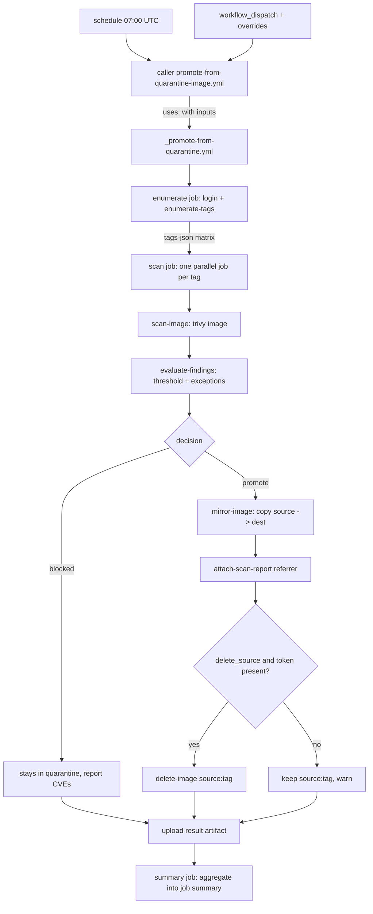

# Promote-from-quarantine workflows architecture

This document describes the architecture of the GitHub Actions workflows that
scan the container images sitting in a `quarantine/<image>` repository and
**promote** the ones that pass a vulnerability policy into a clean
`golden/<image>` repository. It covers:

1. [How are the actions structured?](#how-are-the-actions-structured)
2. [What tooling is used?](#what-tooling-is-used)
3. [What functionality is implemented — and what is not?](#what-functionality-is-implemented-and-what-is-not)

For naming and file-system conventions, see
[workflow naming conventions](../../contributing/workflow-naming.md). For the
mirror workflows that populate quarantine in the first place, see
[image mirror workflows](../acquire/image-mirror-workflows.md).

## Purpose

The mirror workflows keep a private copy of upstream base images fresh inside
`quarantine/<image>`. Quarantine is intentionally *untrusted*: an image landing
there has only been copied, never inspected. The promote-from-quarantine
workflows add
the missing gate. They:

- enumerate every tag in a `quarantine/<image>` repository,
- scan each image with [Trivy](https://github.com/aquasecurity/trivy),
- apply a configurable **severity threshold** plus an optional **CVE exception
  list**, and
- for each image that passes, **copy it into `golden/<image>`**, **attach an OCI
  referrer artifact** that records how/when it was cleared, and **delete the
  original from quarantine**.

```text
upstream → [mirror] → quarantine/<image> → [scan + gate] → golden/<image>
                                                  │
                                                  └─ blocked images stay in quarantine
```

The result is that `golden/<image>` only ever contains images that satisfied the
policy at promotion time, and each one carries a machine-readable scan-report
referrer describing the decision.

## How are the actions structured

The promote-from-quarantine workflows follow the same **caller + reusable workflow**
pattern as the mirror workflows, and the reusable workflows are assembled from
small, single-purpose **composite actions** under
[`.github/actions/`](../../../.github/actions/) (see the
[action catalogue](../../reference/workflow-actions.md)). Each scanned
repository gets a thin caller that only supplies configuration.

```text
.github/
├── actions/                  # composite actions (reusable steps)
│   ├── registry-login/
│   ├── enumerate-tags/
│   ├── scan-image/
│   ├── scan-sbom/
│   ├── evaluate-findings/
│   ├── mirror-image/         # also used to promote (force: true)
│   ├── attach-scan-report/
│   └── delete-image/
└── workflows/
    ├── _promote-from-quarantine.yml      # reusable workflow — image-filesystem scan
    ├── _promote-from-quarantine-sbom.yml # reusable workflow — SBOM-attestation scan (hardened images)
    ├── promote-from-quarantine-python.yml          # caller — quarantine/python  → golden/python
    ├── promote-from-quarantine-node.yml            # caller — quarantine/node    → golden/node
    ├── promote-from-quarantine-openjdk.yml         # caller — quarantine/openjdk → golden/openjdk
    └── promote-from-quarantine-hardened-python.yml # caller — quarantine/hardened/python → base/hardened/python (SBOM-based)
```

- **Display name:** `promote from quarantine / quarantine/<image>` (e.g. `promote from quarantine / quarantine/python`).
- **Concurrency group:** `promote-from-quarantine-<image>` (e.g. `promote-from-quarantine-python`).

This is the third workflow category, alongside `mirror` and `build`. See the
[naming conventions](../../contributing/workflow-naming.md).

### Reusable workflow (`_promote-from-quarantine.yml`)

`_promote-from-quarantine.yml` is an internal workflow (the leading underscore marks it as
"do not run directly"). It is triggered only through `workflow_call` and exposes
the following inputs:

| Input | Required | Default | Description |
| ----- | -------- | ------- | ----------- |
| `source_repo` | yes | — | Quarantine repository to scan, without tag (e.g. `ghcr.io/toddysm/quarantine/python`). |
| `dest_repo` | yes | — | Promotion-target repository, without tag (e.g. `ghcr.io/toddysm/golden/python`). |
| `severity_threshold` | no | `HIGH` | Blocking severity floor: `LOW`, `MEDIUM`, `HIGH`, or `CRITICAL`. Findings at or above this severity block promotion unless excepted. |
| `cve_exceptions` | no | `""` | Pipe-separated allow-list of CVE IDs (e.g. `CVE-2024-1234\|CVE-2024-5678`). |
| `delete_source` | no | `true` | Delete the tag from quarantine after a successful promotion. |
| `trivy_version` | no | pinned | Trivy version to install; also recorded in the referrer artifact. |
| `dry_run` | no | `false` | Scan and report only; never copy, attach, or delete. |

It also accepts one optional secret:

| Secret | Required | Description |
| ------ | -------- | ----------- |
| `ghcr_delete_token` | no | PAT with `delete:packages` used to delete quarantine tags via the GitHub Packages REST API. When absent, deletion is skipped with a warning (see [source deletion](#source-deletion)). |

The reusable workflow defines three jobs running on `ubuntu-latest` with minimal
permissions (`contents: read`, `packages: write`). It fans the work out across a
job matrix so each tag is processed in its own parallel job:

1. **`enumerate`** — logs in to GHCR (`registry-login`), resolves the severity
   set from the threshold, and lists the quarantine tags (`enumerate-tags`),
   emitting them as a JSON array for the matrix.
2. **`scan`** — runs once per tag (`strategy.matrix`, `fail-fast: false`):
   sets up `crane`/`oras`/`trivy`, logs in, scans the image
   (`scan-image`), applies the gate (`evaluate-findings`), and — for passing
   images — promotes it (`mirror-image` with `force: true`), attaches the
   scan-report referrer (`attach-scan-report`), and deletes the source
   (`delete-image`). Each job uploads a small result artifact.
3. **`summary`** — downloads every result artifact and renders one aggregated
   job summary: a one-row-per-tag overview table plus a collapsible per-image
   vulnerability detail (every CVE found at or above the threshold, its
   severity, package, installed/fixed versions, and whether it was blocking or
   excepted).

### Caller workflows (`promote-from-quarantine-<image>.yml`)

Each caller contains no shell logic. A caller only declares:

- **Triggers** — a daily `schedule` (07:00 UTC, after the 06:00 mirror) and a
  manual `workflow_dispatch` exposing overrides for `severity_threshold`,
  `cve_exceptions`, and `dry_run`.
- **Concurrency** — a per-image group (`promote-from-quarantine-<image>`) with
  `cancel-in-progress: false`.
- **Permissions** — `contents: read`, `packages: write`.
- **A single job** that calls `./.github/workflows/_promote-from-quarantine.yml` via `uses:`,
  passes the image-specific inputs, and forwards the `ghcr_delete_token` secret.

Adding a new scanned repository is a copy-and-edit operation on a caller file
with no logic changes.

### Control flow

The `enumerate` job lists every tag in `source_repo` and emits them as a matrix;
the `scan` job then processes each tag independently and in parallel, and the
`summary` job aggregates the results:



### Gate semantics

For each tag the gate is evaluated as follows:

- **Severity floor.** `severity_threshold` is expanded to the set of severities
  at or above it — for example `HIGH` → `HIGH,CRITICAL` — which is passed to
  Trivy's `--severity` flag. Findings below the floor are ignored entirely.
- **Blocking findings.** The CVE IDs Trivy reports at or above the floor.
- **Exceptions.** Any blocking CVE listed in `cve_exceptions` is removed from the
  blocking set and instead recorded in the referrer's `exceptions` annotation.
- **Decision.** If the blocking set is empty after removing exceptions, the image
  is promoted. Otherwise it is left in quarantine and the run reports the
  offending CVEs. Blocked images never fail the whole job; the run finishes and
  the summary lists every outcome.

## SBOM-based scanning for hardened images (`_promote-from-quarantine-sbom.yml`)

Distroless images such as [Docker Hardened Images](https://docs.docker.com/dhi/)
(DHI) ship no package-manager metadata, so `trivy image` cannot enumerate their
packages. Those images instead carry their package inventory as an **SBOM
attestation** — an in-toto statement attached to each platform manifest as an
OCI referrer. The mirror copies these referrers into quarantine (see
[`copy_referrers`](../acquire/image-mirror-workflows.md)), and a dedicated reusable
workflow, `_promote-from-quarantine-sbom.yml`, gates on the SBOM rather than the image
filesystem.

It mirrors `_promote-from-quarantine.yml` (same inputs, gate semantics, scan-report referrer,
source deletion, and reporting) with these differences:

- **Extra input `sbom_predicate_type`** (default `https://cyclonedx.org/bom/v1.6`;
  `https://spdx.dev/Document` also supported) selects which SBOM attestation to
  scan.
- **No upstream re-pull.** The SBOM is read from the GHCR quarantine copy, so
  only GHCR authentication is needed.
- **Per-platform SBOM extraction.** For every platform in the image index the
  workflow:
  1. runs `oras discover` on the platform manifest and finds the referrer whose
     `in-toto.io/predicate-type` annotation matches `sbom_predicate_type`,
  2. fetches that referrer manifest and pulls its first layer blob,
  3. extracts the in-toto statement's `.predicate` (the CycloneDX/SPDX BOM),
     handling both plain statements and DSSE-wrapped envelopes, and
  4. scans the BOM with `trivy sbom`.
- **All platforms gated together.** CVE findings are unioned across platforms;
  promotion is blocked if **any** platform has a blocking CVE after exceptions.
  A platform whose SBOM cannot be found is also treated as a blocking failure,
  since an image whose inventory cannot be read cannot be cleared.
- **Referrer-preserving promotion.** Passing images are promoted with
  `oras cp -r` (index plus per-platform children) so the SBOMs, provenance, VEX,
  and signatures travel into the destination alongside the scan-report referrer.

The scan-report referrer records the scan method in `com.cssc.scan.method`
(`image` for `_promote-from-quarantine.yml`, `sbom` here) and, for SBOM scans, adds
`com.cssc.scan.sbom-predicate-type=<predicate type>`.

The `promote-from-quarantine-hardened-python.yml` caller wires this workflow for
`quarantine/hardened/python → base/hardened/python`. Hardened images are
promoted into a dedicated `base/hardened/<image>` namespace rather than the
`golden/<image>` scheme; see the
[workflow naming conventions](../../contributing/workflow-naming.md).

## What tooling is used

| Tool | Role |
| ---- | ---- |
| **GitHub Actions** | Orchestration: scheduling, manual dispatch, reusable-workflow composition, concurrency, and job summaries. |
| **[Trivy](https://github.com/aquasecurity/trivy)** | Vulnerability scanner. Scans each remote image and emits JSON filtered to the configured severity floor. |
| **[`crane`](https://github.com/google/go-containerregistry/blob/main/cmd/crane/README.md)** | Registry client: `crane ls` to enumerate tags and `crane copy` to promote images (preserving multi-architecture manifest lists). |
| **[`oras`](https://oras.land)** | Creates and attaches the empty scan-report referrer (`oras attach` with annotations only). |
| **`jq`** | Parses Trivy JSON and computes the blocking, excepted, and remaining CVE sets. |
| **`GITHUB_TOKEN`** | Built-in token used to authenticate to GHCR for scan, copy, and attach (`packages: write`). |
| **Optional `ghcr_delete_token` PAT** | Used only for deleting quarantine tags via the GitHub Packages REST API. |
| **`ubuntu-latest` runner** | GitHub-hosted runner the job executes on. |

Key characteristics:

- **`crane copy` preserves multi-architecture manifest lists**, so promoted
  images keep all their original platforms.
- **Pinned tooling.** Third-party setup actions and tool versions are pinned for
  supply-chain safety; the pinned Trivy version is recorded in each referrer.

## Scan-report referrer artifact

For every promoted image the workflow attaches an **OCI referrer artifact** to
the image in `golden/<image>`. It is an *empty* artifact — a manifest with the
standard empty config descriptor and **no layer blobs** — created with
`oras attach` using annotations only. Its `subject` is the promoted image, so
registry clients (`oras discover`, `crane manifest`, etc.) can list it as a
referrer of the image.

- **Artifact type:** `application/vnd.cssc.scan-report.v1+json`

| Annotation key | Example value | Meaning |
| -------------- | ------------- | ------- |
| `org.opencontainers.image.created` | `2026-06-05T07:03:11Z` | Date/time of the scan (RFC 3339, UTC). |
| `com.cssc.scan.source` | `ghcr.io/toddysm/quarantine/python` | Original registry + repository the image came from. |
| `com.cssc.scan.tag` | `3.14-slim` | Image tag that was scanned and promoted. |
| `com.cssc.scan.threshold` | `HIGH` | Severity threshold the image passed. |
| `com.cssc.scan.exceptions` | `CVE-2024-1234\|CVE-2024-5678` | Pipe-separated CVEs found in the image at/above the threshold but cleared via the exception list (empty if none). |
| `com.cssc.scan.scanner` | `trivy` | Scanner name. |
| `com.cssc.scan.scanner-version` | `0.52.0` | Scanner version. |
| `com.cssc.scan.method` | `image` | Scan method: `image` (filesystem) or `sbom` (SBOM attestation). |

## What functionality is implemented and what is not

### Implemented

- **Policy-gated promotion.** Images are copied into `golden/<image>` only when
  they pass the configurable severity threshold after applying the CVE exception
  list.
- **Per-repository tag enumeration.** Every tag in the quarantine repository is
  scanned and gated independently in one run.
- **Multi-architecture preservation** via `crane copy`.
- **Scan-report provenance.** Each promoted image gets an empty OCI referrer
  artifact recording scan date, source, tag, threshold, excepted CVEs, and
  scanner name/version.
- **Quarantine cleanup.** Promoted tags are deleted from quarantine when a
  delete token is configured (see below).
- **Detailed scan reporting.** For every scanned tag the workflow prints a
  report to the run log and to the job summary: whether the image was promoted
  or left in quarantine, and a per-CVE breakdown (severity, package,
  installed/fixed versions) marking each finding as blocking or excepted.
- **Scheduled and manual runs.** A daily cron plus `workflow_dispatch` with
  overrides for threshold, exceptions, and a no-op `dry_run` mode.
- **Concurrency safety.** Per-image concurrency groups prevent overlapping runs.
- **DRY, single-source-of-truth logic.** All behavior lives in one reusable
  workflow; per-image callers are configuration only.

### Source deletion

The built-in `GITHUB_TOKEN` with `packages: write` can push and pull but
**cannot delete** GHCR package versions. Reliable deletion uses the GitHub
Packages REST API
(`DELETE /user/packages/container/<name>/versions/<version_id>`), which requires
a PAT carrying `delete:packages`.

The workflow therefore treats deletion as configurable:

- `delete_source` defaults to `true`.
- Deletion uses the optional `ghcr_delete_token` secret.
- If `delete_source` is `true` but no token is provided, the run **skips
  deletion and logs a warning** rather than failing. The promotion and referrer
  steps still succeed.

### Not implemented (deliberately out of scope)

- **No signing.** Promoted images are not signed (e.g. cosign). The image-based
  scanner (`_promote-from-quarantine.yml`) produces no SBOM/provenance; the SBOM-based
  scanner (`_promote-from-quarantine-sbom.yml`) does not generate attestations but copies the
  upstream's existing SBOM/provenance/VEX/signature referrers verbatim during
  promotion.
- **No automatic remediation.** Blocked images are left in quarantine; the
  workflow does not patch, rebuild, or open tickets for them.
- **No cross-scanner support.** Trivy is the only scanner; the referrer schema
  records the scanner name/version to allow future additions.
- **No retention policy for `golden/`.** Superseded golden tags are not pruned.
- **No notification/alerting by default.** Failures and blocked images surface
  through the normal GitHub Actions run status and the job summary. An *optional*
  approval path (`enable_approval`) adds Slack notifications and a GitHub
  tracking issue for blocked images, with a maintainer-driven `/approve` `/deny`
  override; see
  [override-approval design](promote-from-quarantine-override-approval.md).

## Adding a new promote-from-quarantine workflow

1. Copy `promote-from-quarantine-python.yml` to `promote-from-quarantine-<image>.yml`.
2. Update the display `name:`, the `concurrency.group`, and the inputs
   (`source_repo`, `dest_repo`, and any threshold/exception overrides).
3. No logic changes are needed — the reusable workflow does the work.
