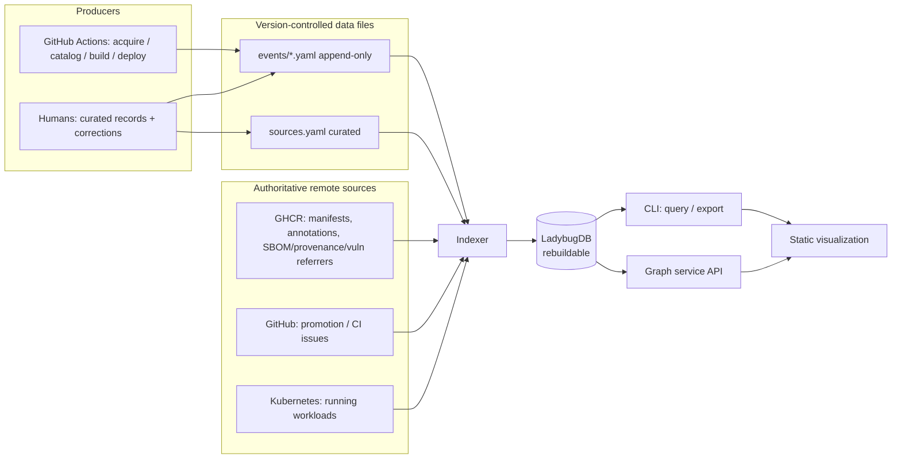
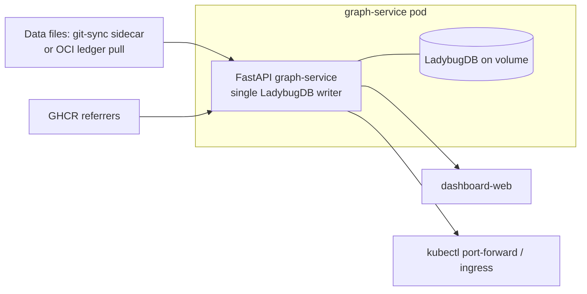

# Supply-chain graph: file-backed indexing

> **Status:** Proposed (design under review). No code has been implemented yet.
> Requirements: [#168](https://github.com/toddysm/cssc-framework/issues/168).
> Storage-engine context: [#145](https://github.com/toddysm/cssc-framework/issues/145)
> (Kùzu is archived; this design uses **LadybugDB** — its maintained successor,
> **confirmed** as the engine.)

This document designs a **local, file-backed supply-chain graph**. The CI/CD
workflows and human authors write small, version-controlled data files. A graph
service (or a CLI) indexes those files into an embedded property graph
(LadybugDB) that can be queried to discover an artifact by any property and
follow its path through acquire → catalog → build → deploy → run.

It follows the agreed flow:

1. Keep source declarations and manually authored events in versioned YAML/JSON.
2. Keep OCI/GitHub/Kubernetes as authoritative remote sources.
3. Make LadybugDB entirely rebuildable.
4. Provide CLI indexing and export commands independent of the web server.
5. Add live API ingestion only after the batch workflow proves insufficient.

## Contents

1. [Motivation](#motivation)
2. [Goals and non-goals](#goals-and-non-goals)
3. [End-to-end data flow](#end-to-end-data-flow)
4. [Writing data from GitHub Actions](#writing-data-from-github-actions)
5. [Folder structure of the data files](#folder-structure-of-the-data-files)
6. [Data schema (file content)](#data-schema-file-content)
7. [Indexing model](#indexing-model)
8. [Local CLI experience](#local-cli-experience)
9. [Running as a Kubernetes service](#running-as-a-kubernetes-service)
10. [Design decisions and alternatives](#design-decisions-and-alternatives)
11. [Phased delivery](#phased-delivery)
12. [Security considerations](#security-considerations)
13. [Open questions](#open-questions)
14. [Tracking issues](#tracking-issues)

## Motivation

The framework already emits rich supply-chain signals — mirror history, OCI
annotations, SPDX SBOM referrers, SLSA provenance referrers, vulnerability
attestations, GHCR package listings, and promotion/CI tracking issues — but they
live in many places and answer only single-hop questions. The goal is a graph
that can answer multi-hop questions ("show the full path of this digest", "what
deployments run an image transitively affected by CVE-X", "where was this CVE
introduced in the lineage") from data that is **reviewable in Git** and a graph
database that is **always rebuildable** from that data plus the registry.

## Goals and non-goals

**Goals**

- Producers (the acquire/catalog/build/deploy workflows) and humans write small
  files; nothing needs the graph service to be running to record data.
- The graph database is derived state — deleting it and re-indexing reproduces
  it exactly.
- Every edge carries evidence (a run URL, an issue URL, a referrer digest) so
  the graph can explain *why* a relationship exists.
- The same data indexes identically on a laptop (CLI) and in a Kubernetes pod.

**Non-goals (initially)**

- An always-on ingestion API (added only if batch proves insufficient — flow
  step 5).
- Treating the graph database as the source of truth.
- Guaranteeing exact layer/CVE-introduction attribution when the scanner cannot
  prove it (the graph records confidence, not fiction).

## End-to-end data flow



Two inputs feed the indexer:

- **Repo data files** — the durable, reviewable ledger of supply-chain *events*
  (small: identifiers, digests, timestamps, evidence links).
- **Remote authoritative sources** — heavy payloads (SBOM, provenance, vuln
  reports, live deployment state) are *referenced* from events and fetched at
  index time rather than duplicated into Git. `sources.yaml` lists the roots the
  indexer may crawl.

## Writing data from GitHub Actions

The acquire, catalog, build, and deploy workflows already know the facts we want
(source/dest digests, tags, base digest, run URL, attestation digests). Each
workflow emits **one immutable event file per run** describing what it just did,
then makes that file durable.

### The core rule: producers only ever create new immutable files

Producers **never edit or delete** an existing data file. Every run writes a new
file whose name is derived from its content (timestamp + stage + short content
hash). This single rule gives us:

- **No merge conflicts** — two concurrent runs write two different files.
- **Idempotency** — re-running the same step reproduces the same filename and
  content, so a retry is a no-op (or an identical overwrite).
- **A complete audit trail** — history is the set of event files, never mutated.

Mutable, human-curated records (`sources.yaml`, manual corrections) are edited
by people through pull requests, not by workflows.

### What each workflow records

| Workflow (stage) | Event kind(s) | Key fields |
|---|---|---|
| `mirror-*` (acquire) | `ArtifactMirrored`, `TagObserved` | source ref+digest, dest repo+digest, dest tag, run URL |
| `promote-from-quarantine*` (catalog) | `ArtifactPromoted`, `ScanRecorded`, `TagObserved` | src/dest repo+digest, tag, vuln-attestation digest, issue URL, run URL |
| `build-cssc-dashboard` (build) | `ArtifactBuilt`, `BaseImageObserved`, `TagObserved` | image repo+digest, base name@digest + base tag, SBOM/provenance referrer digests, source commit, run URL |
| deploy (deploy/run) | `ArtifactDeployed` | image repo+digest, environment/cluster/namespace, chart+version, run URL |

Heavy inventory (SBOM, provenance, vuln report) is **not** copied into the event.
The event records the *referrer digest*, and the indexer pulls the referrer from
the registry (or a cached copy under `inventory/`) when it needs the details.

### How the file becomes durable — decision

**Decision:** the data lives in this repository as committed files. Producers
write their event files and commit them; when concurrent runs contend on the
branch, they commit to a dedicated **`supply-chain-graph-data`** branch instead
of the default branch. Because every run writes a *new, uniquely named* file, the
only possible collision is the git-ref race, not a content conflict.

Two write paths satisfy this:

1. **Direct commit to the data branch (default).** Each run adds its event
   file(s) and pushes to `supply-chain-graph-data` with rebase-retry. Simple, and
   the branch stays plain, reviewable files.
2. **Serialized collector.** Runs upload event files as workflow artifacts; a
   single scheduled/`workflow_run` collector commits them. One writer → no ref
   races. Use this if direct commits contend too often.

An **OCI artifact ledger** — pushing events under a reserved tag exactly like the
existing [`mirror-history`](../../../.github/actions/mirror-history/action.yml)
action and reading them back with
[`OciRegistryClient`](../../../apps/python-app/libs/cssc_common/cssc_common/registry.py)
— stays available as an alternative if we ever want zero repo commits, but it is
**not** the default: the source repository is the system of record.

### Considerations for the workflow authors

- **Permissions.** Committing event files needs `contents: write`, scoped to
  the `supply-chain-graph-data` branch where possible.
- **No secrets, ever.** Events contain only digests, refs, tags, timestamps, and
  public run/issue URLs. Never write tokens or signing material (repo push
  protection will also block them).
- **Pin by digest.** Record immutable `repo@sha256:...`; tags are recorded
  separately as `TagObserved` observations with a timestamp.
- **Evidence is mandatory.** Every event carries `source.runUrl` (and issue URL
  or referrer digest where relevant) so the edge is explainable and auditable.
- **Ordering is by observation time, not file arrival.** The indexer sorts by
  `recordedAt`; late-arriving events still land in the right place in history.
- **Size.** Keep events small; reference heavy payloads (SBOM/scan) by referrer
  digest. Ingesting those payloads is **deferred** (see Phased delivery), so
  events stay tiny for now.
- **Trust.** Only first-party workflows and reviewed PRs can write data; the
  indexer treats event `source` as provenance, not as proof of correctness.

## Folder structure of the data files

A single data root (proposed name `supply-chain-graph/` at the repo root, or
under `apps/python-app/` next to the service that owns it — see
[open questions](#open-questions)):

```text
supply-chain-graph/
  README.md                     # what this tree is, how it is written/indexed
  sources.yaml                  # curated: remote roots the indexer may crawl
  schema/                       # JSON Schemas for each record kind (validation)
    envelope.schema.json
    event.schema.json
    ...
  events/                       # producer-written, append-only, IMMUTABLE
    2026/
      08/
        09/
          20260809T121500Z-acquire-artifact-mirrored-a1b2c3.yaml
          20260809T131000Z-catalog-artifact-promoted-d4e5f6.yaml
          20260809T140500Z-build-artifact-built-7890ab.yaml
          20260809T150000Z-deploy-artifact-deployed-cd12ef.yaml
  artifacts/                    # OPTIONAL curated static facts per occurrence
    ghcr.io/toddysm/golden/python/
      sha256-1a2b3c….yaml
  inventory/                    # DEFERRED — cached SBOM/scan payloads by digest
    sha256-1a2b3c…/             # (not populated in the initial phases)
      sbom.spdx.json
      vulnerabilities.json
```

Design intent of the layout:

- **`events/` is the heart** and the only thing workflows write. Date-partitioned
  so directories stay small and diffs are local; filenames are
  `<ts>-<stage>-<kind>-<hash>` so they are unique, sortable, and idempotent.
- **`sources.yaml`** is the only file humans routinely edit; it declares GHCR
  repos, the mirror-history ledger, GitHub issue queries, and (optionally) a
  kube context to crawl.
- **`artifacts/`** holds only curated corrections/annotations you cannot derive
  from events or the registry; most artifact facts are indexed from the registry.
- **`inventory/`** is **deferred**: it will cache SBOM/scan payloads for offline
  rebuilds once inventory ingestion lands; the initial phases do not use it.

## Data schema (file content)

All records share a common **envelope** so the indexer can dispatch on `kind`
and enforce identity/idempotency uniformly.

### Envelope

```yaml
schemaVersion: 1
kind: ArtifactPromoted        # the record type
id: sha256:…                  # stable content hash of the semantic payload
recordedAt: 2026-08-09T13:10:00Z
source:                       # provenance / evidence for THIS record
  type: github-actions
  workflow: promote-from-quarantine-python
  runUrl: https://github.com/toddysm/cssc-framework/actions/runs/123456789
  runId: "123456789"
  runAttempt: "1"
# ...kind-specific fields below...
```

`id` is derived from the semantic payload (not from `recordedAt`) so the same
event recorded twice collapses to one node.

### `sources.yaml` (curated)

```yaml
schemaVersion: 1
sources:
  - type: ghcr
    repository: ghcr.io/toddysm/golden/python
  - type: mirror-history
    repository: ghcr.io/toddysm/quarantine/python   # reads :mirror-history ledger
  - type: github-issues
    repo: toddysm/cssc-framework
    labels: [promotion-pending, promotion-approved]
  - type: kubernetes           # optional; live deployment inventory
    context: kind-cssc
    namespaces: [default]
```

### Artifact and occurrence identity

An **artifact** is immutable content (a digest). An **occurrence** is that digest
appearing in a specific repository/role. The same digest in
`quarantine/python` and `golden/python` is one artifact, two occurrences — this
is what lets promotion be an edge instead of a self-loop.

```yaml
# kind: ArtifactObserved  (usually derived from the registry, rarely hand-written)
schemaVersion: 1
kind: ArtifactObserved
id: sha256:1a2b3c…
recordedAt: 2026-08-09T14:05:00Z
artifact:
  digest: sha256:1a2b3c…
  mediaType: application/vnd.oci.image.index.v1+json
  artifactType: ""            # set for referrers (SBOM, vuln, provenance)
  platforms: [linux/amd64, linux/arm64]
occurrence:
  registry: ghcr.io
  repository: toddysm/golden/python
annotations:
  org.opencontainers.image.base.name: ghcr.io/toddysm/golden/python
  com.toddysm.image.base.tag: "3.14-slim"
source: { type: github-actions, runUrl: … }
```

### Supply-chain events

Each stage is one edge-producing record. Examples:

```yaml
# acquire
kind: ArtifactMirrored
from: { registry: docker.io, repository: library/python, digest: sha256:up… }
to:   { registry: ghcr.io, repository: toddysm/quarantine/python, digest: sha256:up… }
tag:  "3.14-slim"
force: false
source: { type: github-actions, runUrl: … }
---
# catalog
kind: ArtifactPromoted
from: { registry: ghcr.io, repository: toddysm/quarantine/python, digest: sha256:up… }
to:   { registry: ghcr.io, repository: toddysm/golden/python, digest: sha256:up… }
tag:  "3.14-slim"
evidence:
  vulnAttestationDigest: sha256:att…      # referrer to pull for CVE detail
  issueUrl: https://github.com/toddysm/cssc-framework/issues/77
source: { type: github-actions, runUrl: … }
---
# build
kind: ArtifactBuilt
image: { registry: ghcr.io, repository: toddysm/apps/cssc-dashboard/issues-service, digest: sha256:app… }
base:  { name: ghcr.io/toddysm/golden/python, digest: sha256:up…, tag: "3.14-slim" }
buildVersion: "0.1.2-abc1234"
sourceCommit: abc1234…
referrers:
  sbomDigest: sha256:sbom…
  provenanceDigest: sha256:prov…
source: { type: github-actions, runUrl: … }
---
# deploy
kind: ArtifactDeployed
image: { registry: ghcr.io, repository: toddysm/apps/cssc-dashboard/issues-service, digest: sha256:app… }
environment: { cluster: kind-cssc, namespace: default }
chart: { name: cssc-dashboard, version: "0.1.2" }
source: { type: github-actions, runUrl: … }
```

### Tag history (temporal)

Tags move, so they are recorded as **append-only observations**, never as one
mutable pointer:

```yaml
kind: TagObserved
occurrence: { registry: ghcr.io, repository: toddysm/golden/python }
tag: "3.14-slim"
digest: sha256:1a2b3c…
observedAt: 2026-08-09T13:10:05Z
source: { type: github-actions, runUrl: … }
```

The indexer builds `Tag -[POINTED_TO {from,to}]-> Artifact` edges by ordering
observations, so "every digest this tag pointed to over time" is a direct query.

### Inventory, packages, files, vulnerabilities (deferred)

> **Deferred.** SBOM/scan ingestion is out of the initial scope. The schema below
> is retained as the target design; the first phases index provenance and lineage
> without it.

These come from referrers (SBOM/provenance/vuln attestations) that events point
to. The indexer normalizes them into nodes:

- `Package` keyed by PURL (version, type, supplier, licenses, evidence).
- `File` (path, digest, size, mode, originating layer, whiteout status).
- `Layer` (ordered, associated with the platform manifest that was scanned).
- `Vulnerability` (CVE id, severity, fixed/affected versions, scanner, scan time,
  status) linked `Package -[AFFECTED_BY]-> Vulnerability`.

Introduction attribution (`Vulnerability -[INTRODUCED_IN]-> Layer|Artifact`) is
computed by comparing package/layer evidence across an image and its ancestors,
and is tagged with a **confidence** (`evidence` vs `inferred` vs `unknown`) — the
graph never asserts an exact introducing layer the data cannot prove.

### Validation

Every record is validated against a JSON Schema in `schema/` before indexing.
The indexer rejects unknown `kind`s, malformed identity, and unresolved
references with actionable diagnostics (which file, which field, why) rather than
silently producing a partial graph.

## Indexing model

- **Load** all repo event files + `sources.yaml`.
- **Validate** against schema; collect diagnostics.
- **Resolve** remote references (registry manifests/referrers, GitHub issues,
  optional kube state) named by events and `sources.yaml`.
- **Upsert** nodes and edges into LadybugDB using deterministic keys
  (`digest+repository` for occurrences, `id` for events), so re-indexing is
  idempotent — a full rebuild and an incremental pass converge to the same graph.
- **Tombstones**: a `kind: Retraction` record (human, via PR) can supersede an
  earlier event without deleting history; the indexer marks the target inactive.

LadybugDB is embedded and single-writer: exactly **one** process owns the
read-write database; it may open many connections for concurrent reads.

## Local CLI experience

A single `cssc-graph` CLI does everything without the web server (flow step 4).
It is implemented in **Python with [Click](https://click.palletsprojects.com/)**:
a top-level `click.Group` named `cssc-graph` with one subcommand per verb, wired
as a console-script entry point (`cssc-graph = cssc_graph.cli:main`) in the owning
package's `pyproject.toml`. Click gives composable subcommands, typed and
validated options/arguments, and `--help` for free; the FastAPI service imports
the same underlying functions so the CLI and the API share one query layer:

```bash
# Build/refresh the local graph from files (+ remote refs) into ./.graph
cssc-graph index ./supply-chain-graph --database ./.graph --sources supply-chain-graph/sources.yaml

# Validate data files without touching the database (great for pre-commit / CI)
cssc-graph validate ./supply-chain-graph

# --- query the user journeys from #168 ---

# Full path of a digest (all occurrences + upstream & downstream)
cssc-graph path --digest sha256:1a2b3c… 

# Everything a tag ever pointed to, chronologically
cssc-graph tag-history --repo ghcr.io/toddysm/golden/python --tag 3.14-slim

# Base images (direct + transitive) of a built image, and reverse
cssc-graph bases   --ref ghcr.io/toddysm/apps/cssc-dashboard/issues-service@sha256:app…
cssc-graph derived --base ghcr.io/toddysm/golden/python@sha256:up…

# Find artifacts by property / annotation / type / signer
cssc-graph find --annotation com.toddysm.image.base.tag=3.14-slim
cssc-graph find --type application/vnd.in-toto+json
cssc-graph find --signer https://github.com/toddysm/...

# DEFERRED (needs SBOM/scan ingestion): --package / --file and the CVE commands
#   cssc-graph find --package "pkg:pypi/requests@2.31.0"
#   cssc-graph find --file /etc/ssl/openssl.cnf
#   cssc-graph impact --cve CVE-2025-12345
#   cssc-graph introduced --cve CVE-2025-12345 --ref …@sha256:app…

# Inspect one artifact (annotations, signatures/signers, referrers, layers)
cssc-graph show --ref ghcr.io/toddysm/golden/python@sha256:1a2b3c…

# Raw Cypher for anything bespoke
cssc-graph cypher "MATCH (a:Artifact)-[:PROMOTED_FROM]->(q) RETURN a,q LIMIT 20"

# Export a bounded subgraph for offline visualization (no server needed)
cssc-graph export --format cytoscape --ref sha256:app… --depth 3 --output site/graph.json
cssc-graph export --format mermaid   --digest sha256:1a2b3c… > path.mmd
```

Conventions: each verb is a Click subcommand; `--output`/`--format
{table,json,cytoscape,mermaid}` on every query; human table by default, `--json`
for scripting; every command is read-only except `index`. Exit non-zero on
validation errors so it drops into pre-commit and CI.

## Running as a Kubernetes service

The same indexer and query engine run inside a **`graph-service`** pod — a fourth
FastAPI service beside `packages-service`, `issues-service`, and `dashboard-web`,
with its own Helm subchart under the umbrella chart.



- **Getting the data into the pod** (pick one, mirrors the write-back choice):
  - *git-sync sidecar / init container* clones the repo (or the
    `supply-chain-graph-data` branch) to a shared volume; or
  - the service **pulls the OCI event ledger** with `OciRegistryClient` (no repo
    clone) — preferred, since it reuses `mirror-history` mechanics.
- **Indexing on startup.** An init container (or the app's startup hook) runs
  `cssc-graph index` into the database directory, then marks readiness only after
  the index succeeds. A **reindex** is triggered by `POST /index/rebuild` or a
  Kubernetes `Job`/`CronJob`, not by editing files in place.
- **Persistence.** Two supported modes:
  - *Rebuildable/ephemeral* (default for the demo): `emptyDir`, rebuilt from files
    + registry on every start — cleanest, no state to manage.
  - *PVC-backed*: keep the database on a `PersistentVolumeClaim` for faster
    restarts; still fully rebuildable on demand.
- **Single writer.** One replica owns the read-write database. If read scale is
  ever needed, run one indexer/writer and expose read-only replicas from copies
  of the database directory — do **not** point multiple writers at one database.
- **HTTP API** (curated, mirrors the CLI):

  ```text
  POST /index/rebuild
  GET  /artifacts/{digest}/path
  GET  /artifacts/resolve?ref=<repo@digest|repo:tag>
  GET  /repositories/{repo}/tags/{tag}/history
  GET  /artifacts/{digest}/bases        GET /artifacts/{digest}/derived
  GET  /search?annotation=…&package=…&file=…&type=…&signer=…
  GET  /vulnerabilities/{cve}/impact
  GET  /vulnerabilities/{cve}/introduced?ref=…
  GET  /graph/neighborhood?ref=…&depth=3   # bounded, for dashboard-web viz
  ```

- **Health/limits.** `/healthz` (process up) and `/readyz` (index loaded);
  bounded neighborhood responses and depth caps so a query can't return the whole
  graph; anonymous in-cluster reads like the other demo services, with only
  outbound GHCR/GitHub calls authenticated.

## Design decisions and alternatives

| Decision | Choice | Why | Alternative |
|---|---|---|---|
| Data location | Committed files in this repo (dedicated `supply-chain-graph-data` branch if runs contend) | Source repo is the system of record; reviewable; new-file-only avoids content conflicts | OCI ledger (kept as an alternative); commit to default branch (more ref races) |
| Heavy payloads | Referenced by digest; **ingestion deferred** | Unblocks core provenance/lineage now; keeps Git small | Inline SBOM/scan (bloats diffs) |
| Tag modelling | Append-only observations | Preserves full tag history | Single mutable pointer (loses history) |
| DB persistence | Rebuildable, PVC optional | Derived state, disposable | Treat DB as source of truth (fragile) |
| Engine | **LadybugDB** (embedded, Cypher) — confirmed | Maintained successor to Kùzu; no server; Py 3.14 wheels | Neo4j/Memgraph (server); SQLite CTEs (verbose paths) |
| CLI framework | **Python Click** | Composable subcommands, typed options, one query layer shared with the API | argparse (boilerplate); Typer (extra dependency) |
| Ingestion | Batch index at startup/CLI | Simplicity; matches flow steps 1–4 | Live API ingestion (flow step 5, later) |

## Phased delivery

1. **Schema + files + validate.** Define envelope/record JSON Schemas, the folder
   layout, `sources.yaml`, and the Click `cssc-graph validate` command.
2. **Indexer + LadybugDB.** Build the graph schema and idempotent upsert; `index`.
3. **Acquire/catalog producers.** Emit `ArtifactMirrored`/`Promoted`/`TagObserved`
   from the mirror + promote workflows, committing event files to the
   `supply-chain-graph-data` branch.
4. **Provenance queries + CLI.** `path`, `tag-history`, `bases`/`derived`, `show`,
   `find` (annotation/type/signer), `export`.
5. **Build producers + base lineage.** `ArtifactBuilt`, `BaseImageObserved`,
   `TagObserved` from the build workflow — gives recursive base-image lineage.
6. **graph-service + dashboard views.** FastAPI service, Helm subchart, bounded
   neighborhood API, deploy producers (`ArtifactDeployed`).
7. **(Deferred) SBOM/scan ingestion.** Packages, files, vulnerabilities, and the
   `find --package/--file`, `impact`, and `introduced` queries — pulled from
   SBOM/vuln referrers once we pick this up.

## Security considerations

- **No secrets in data files**; only digests, refs, timestamps, and public URLs.
- **Producers are first-party only**; human records land through reviewed PRs.
- **The graph reports evidence and confidence**, never fabricated attribution.
- **Outbound-only auth** in the service (GHCR/GitHub); reads are anonymous
  in-cluster like the other demo services.
- **Bounded responses** prevent a single query from dumping the whole graph.

## Decisions (resolved 2026-08-09)

- **Data root:** a new top-level `supply-chain-graph/` folder in this repository.
- **Durability:** the data lives in the source repository as committed files; when
  concurrent runs contend, they commit to a dedicated `supply-chain-graph-data`
  branch (with a serialized collector as the fallback). The OCI ledger is kept
  only as an alternative, not the default.
- **SBOM/scan payloads:** **deferred** — the first phases deliver provenance, tag
  history, and base lineage; packages/files/CVEs come later.
- **Engine:** **LadybugDB**, confirmed (supersedes #145's archived Kùzu choice).
- **CLI:** implemented in **Python with Click**.

## Tracking issues

- Requirements: [#168](https://github.com/toddysm/cssc-framework/issues/168)
- Original decision record (engine superseded): [#145](https://github.com/toddysm/cssc-framework/issues/145)

Implementation work items will be filed after this design is reviewed, following
the repository's design-doc-first process.
