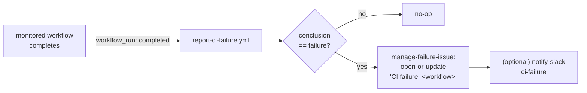

# CI failure notifications design

> **Status:** Proposed (design under review). No code has been implemented yet.
> Tracking issue and implementation tasks are linked at the bottom.

This document designs an **automatic issue-filing mechanism for CI failures**:
when one of the repository's GitHub Actions workflows finishes in a failed
state, a GitHub issue is opened (or refreshed) so the failure is visible to the
whole team rather than only in the Actions tab or a single author's email.

It covers:

1. [Motivation](#motivation)
2. [Goals and non-goals](#goals-and-non-goals)
3. [Approach: a workflow_run monitor](#approach-a-workflow_run-monitor)
4. [Components](#components)
5. [Issue lifecycle and de-duplication](#issue-lifecycle-and-de-duplication)
6. [The startup_failure caveat](#the-startup_failure-caveat)
7. [Design decisions and alternatives](#design-decisions-and-alternatives)
8. [Phased delivery](#phased-delivery)
9. [Security considerations](#security-considerations)

## Motivation

Today the only automated issue this repository files is a **promotion tracking
issue** — opened by the `notify` job of the promote-from-quarantine reusable
workflows ([`_promote-from-quarantine.yml`](../../../.github/workflows/_promote-from-quarantine.yml)
and [`_promote-from-quarantine-sbom.yml`](../../../.github/workflows/_promote-from-quarantine-sbom.yml))
when an image is *policy-blocked* (and only with `enable_approval`). See the
[override-approval design](promote-from-quarantine-override-approval.md).

A *policy-blocked image* is not a CI failure — it is an expected outcome of a
**successful** run. A genuine CI failure (a crashed step, an authentication
error, a registry outage, or a workflow that fails to start) currently surfaces
only through:

- the red run status in the Actions tab, and
- GitHub's default e-mail to the **author of the workflow file** for failed
  *scheduled* runs.

Both are easy to miss. This was demonstrated concretely when every scheduled
promote run failed at startup for over two weeks before it was noticed. The goal
is to turn any CI failure into a visible, de-duplicated GitHub issue (and,
optionally, a Slack alert).

## Goals and non-goals

**Goals**

- File a GitHub issue automatically when a monitored workflow concludes in
  `failure`.
- De-duplicate: one open issue per failing workflow, updated on repeated
  failures rather than spamming a new issue each time.
- Reuse the repository's existing conventions (composite actions, `gh`-based
  REST calls, optional Slack via [`notify-slack`](../../reference/workflow-actions.md)).
- Keep the monitored-workflow list explicit and easy to extend.

**Non-goals**

- Diagnosing *why* a workflow failed (the issue links to the run; humans triage).
- Replacing the promotion tracking-issue flow (that is a separate, policy concern).
- Guaranteeing capture of `startup_failure` runs — see the
  [caveat](#the-startup_failure-caveat).

## Approach: a workflow_run monitor

A single, repository-wide workflow — proposed name **`report-ci-failure.yml`**
(display name `report / ci-failure`) — subscribes to the completion of the
monitored workflows via the [`workflow_run`](https://docs.github.com/actions/using-workflows/events-that-trigger-workflows#workflow_run)
event and acts only when the observed run failed.

```yaml
on:
  workflow_run:
    workflows:
      - "mirror / quarantine/python"
      - "mirror / quarantine/node"
      - "mirror / quarantine/openjdk"
      - "mirror / quarantine/hardened/python"
      - "promote from quarantine / quarantine/python"
      - "promote from quarantine / quarantine/node"
      - "promote from quarantine / quarantine/openjdk"
      - "promote from quarantine / quarantine/hardened/python"
      - "promote override"
    types: [completed]
```



The `workflow_run` event always runs the **default-branch** version of
`report-ci-failure.yml`, regardless of which branch the failing run used — so the
monitor logic cannot be tampered with from a feature branch or fork. The event
payload (`github.event.workflow_run`) provides everything the issue needs: the
workflow `name`, `html_url`, `head_branch`, `event`, `run_number`, `id`, and
`conclusion`.

## Components

| Component | Type | Responsibility |
| --------- | ---- | -------------- |
| `report-ci-failure.yml` | Workflow (`workflow_run`) | Fire on monitored-workflow completion; on `failure`, open/update the issue and optionally alert Slack. |
| `manage-failure-issue` | New composite action | Open-or-update / close a **CI-failure** tracking issue, deduped by the `ci-failure` label plus the title `CI failure: <workflow>`. |
| [`notify-slack`](../../reference/workflow-actions.md) | Existing action (extended in a later phase) | Post a `ci-failure` Slack message. Requires a new status template. |

A dedicated `manage-failure-issue` action is proposed rather than reusing
[`manage-issue`](../../reference/workflow-actions.md): the latter is purpose-built
for the promotion flow (title `Promotion blocked: <image>:<tag>`, the
`promotion-pending`/`-approved`/`-denied` labels, and a **required** embedded
metadata block). CI-failure issues need none of that and use a different title,
label, and lifecycle. Keeping a separate action avoids destabilising the stable
override flow. See [alternatives](#design-decisions-and-alternatives).

## Issue lifecycle and de-duplication

- **Title:** `CI failure: <workflow name>` (one issue per workflow).
- **Label:** `ci-failure` (created idempotently by the action).
- **Open / update:** on a `failure`, if an open `ci-failure` issue with that
  title exists it is updated (a new comment recording the run number, branch,
  triggering event, and a link to the failed run); otherwise a new issue is
  created with the same details in the body.
- **Close (Phase 2):** when the *same* workflow later concludes `success`, the
  monitor closes the open `ci-failure` issue for it, so a recovered workflow does
  not leave a stale issue open.

This "one open issue per failing workflow, updated until it recovers" model keeps
the issue list signal-rich and avoids a new issue per failed run.

## The startup_failure caveat

The failure class that originally motivated this work — a `startup_failure`,
where a workflow is rejected before any job runs — is the **hardest to catch
automatically**:

- An in-workflow `if: failure()` handler job cannot help, because no jobs run at
  all.
- The `workflow_run` event is **not reliably emitted** for runs that fail at
  startup, so even this monitor may not see them.

The honest mitigation for that specific class is **prevention**: keep workflows
valid via `actionlint`, CodeQL, and PR review (the missing-permission bug that
caused the original startup failures is exactly what a reviewer caught). GitHub's
default e-mail to the scheduled-workflow author remains a backstop. This document
explicitly does **not** promise `startup_failure` coverage; it covers the much
more common case of a run that starts and then fails.

## Design decisions and alternatives

1. **`workflow_run` monitor vs. per-workflow `if: failure()` handler.** A single
   monitor centralises the logic, covers many workflows from one file, and (for
   non-startup failures) catches whole-run failures that a same-run handler would
   also catch — without editing every workflow. The trade-off is the explicit
   `workflows:` list, which must be updated when a monitored workflow is added or
   renamed. Accepted: the list lives in one place and is easy to review.

2. **New `manage-failure-issue` action vs. generalising `manage-issue`.**
   Generalising `manage-issue` (adding a `category`/`label`/`title` mode) would
   avoid a second action but risks regressing the security-sensitive override
   flow that depends on its exact titles, labels, and metadata contract. A small,
   single-responsibility `manage-failure-issue` action is lower-risk and matches
   the repo's "One verb-noun per action" rule. Accepted.

3. **Issue per workflow vs. issue per run.** Per-workflow de-duplication avoids
   issue spam during a sustained outage. Accepted.

4. **Slack now vs. later.** [`notify-slack`](../../reference/workflow-actions.md)
   currently only knows the `blocked-pending | approved | denied` templates, so a
   `ci-failure` template is a small extension. To keep Phase 1 minimal, Slack is
   deferred to Phase 2; the issue alone provides visibility.

## Phased delivery

- **Phase 1 (core):** `manage-failure-issue` action + `report-ci-failure.yml`
  monitor that opens/updates a `ci-failure` issue on `failure`.
- **Phase 2 (recovery + Slack):** auto-close the issue when the workflow recovers
  (`success`), and add a `ci-failure` Slack template wired into the monitor.
- **Docs:** add a **Report** category to the
  [workflow naming conventions](../../contributing/workflow-naming.md), document
  `manage-failure-issue` in the
  [workflow actions reference](../../reference/workflow-actions.md), and link this
  document from the [workflow architecture index](README.md).

## Security considerations

- The monitor needs only `issues: write` (and `contents: read` for checkout); it
  performs no registry operations.
- Because `workflow_run` runs the default-branch definition, the issue-filing
  logic is not modifiable from forks or feature branches.
- The action authenticates with the built-in `GITHUB_TOKEN`; no PAT is required.
- Issue bodies/comments contain only the workflow name, run metadata, and a link
  to the run — no secrets — and all interpolation goes through `gh` arguments or
  `--body-file`, never an `eval`-style shell expansion.

## Tracking

- **Tracking issue:** [#80](https://github.com/toddysm/cssc-framework/issues/80)
- **Phase 1:** [#81](https://github.com/toddysm/cssc-framework/issues/81) `manage-failure-issue` action · [#82](https://github.com/toddysm/cssc-framework/issues/82) `report-ci-failure.yml` monitor
- **Phase 2:** [#83](https://github.com/toddysm/cssc-framework/issues/83) auto-close on recovery · [#84](https://github.com/toddysm/cssc-framework/issues/84) Slack `ci-failure` notification
- **Docs:** [#85](https://github.com/toddysm/cssc-framework/issues/85) naming, actions reference, and index wiring
