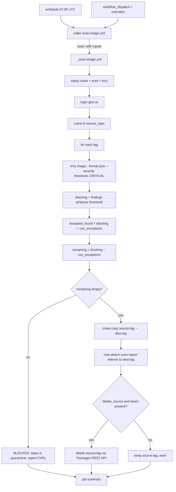

# Scan-and-promote workflows architecture

This document describes the architecture of the GitHub Actions workflows that
scan the container images sitting in a `quarantine/<image>` repository and
**promote** the ones that pass a vulnerability policy into a clean
`golden/<image>` repository. It covers:

1. [How are the actions structured?](#how-are-the-actions-structured)
2. [What tooling is used?](#what-tooling-is-used)
3. [What functionality is implemented — and what is not?](#what-functionality-is-implemented-and-what-is-not)

For naming and file-system conventions, see
[workflow naming conventions](../../contributing/workflow-naming.md). For the
mirror workflows that populate quarantine in the first place, see
[image mirror workflows](image-mirror-workflows.md).

## Purpose

The mirror workflows keep a private copy of upstream base images fresh inside
`quarantine/<image>`. Quarantine is intentionally *untrusted*: an image landing
there has only been copied, never inspected. The scan-and-promote workflows add
the missing gate. They:

- enumerate every tag in a `quarantine/<image>` repository,
- scan each image with [Trivy](https://github.com/aquasecurity/trivy),
- apply a configurable **severity threshold** plus an optional **CVE exception
  list**, and
- for each image that passes, **copy it into `golden/<image>`**, **attach an OCI
  referrer artifact** that records how/when it was cleared, and **delete the
  original from quarantine**.

```text
upstream → [mirror] → quarantine/<image> → [scan + gate] → golden/<image>
                                                  │
                                                  └─ blocked images stay in quarantine
```

The result is that `golden/<image>` only ever contains images that satisfied the
policy at promotion time, and each one carries a machine-readable scan-report
referrer describing the decision.

## How are the actions structured

The scan-and-promote workflows follow the same **caller + reusable workflow**
pattern as the mirror workflows. All shared logic lives in one reusable
workflow, and each scanned repository gets a thin caller that only supplies
configuration.

```text
.github/workflows/
├── _scan-image.yml      # reusable workflow — all the logic
└── scan-python.yml      # caller — quarantine/python → golden/python
```

- **Display name:** `scan / quarantine/<image>` (e.g. `scan / quarantine/python`).
- **Concurrency group:** `scan-quarantine-<image>` (e.g. `scan-quarantine-python`).

This is the third workflow category, alongside `mirror` and `build`. See the
[naming conventions](../../contributing/workflow-naming.md).

### Reusable workflow (`_scan-image.yml`)

`_scan-image.yml` is an internal workflow (the leading underscore marks it as
"do not run directly"). It is triggered only through `workflow_call` and exposes
the following inputs:

| Input | Required | Default | Description |
| ----- | -------- | ------- | ----------- |
| `source_repo` | yes | — | Quarantine repository to scan, without tag (e.g. `ghcr.io/toddysm/quarantine/python`). |
| `dest_repo` | yes | — | Promotion-target repository, without tag (e.g. `ghcr.io/toddysm/golden/python`). |
| `severity_threshold` | no | `HIGH` | Blocking severity floor: `LOW`, `MEDIUM`, `HIGH`, or `CRITICAL`. Findings at or above this severity block promotion unless excepted. |
| `cve_exceptions` | no | `""` | Pipe-separated allow-list of CVE IDs (e.g. `CVE-2024-1234\|CVE-2024-5678`). |
| `delete_source` | no | `true` | Delete the tag from quarantine after a successful promotion. |
| `trivy_version` | no | pinned | Trivy version to install; also recorded in the referrer artifact. |
| `dry_run` | no | `false` | Scan and report only; never copy, attach, or delete. |

It also accepts one optional secret:

| Secret | Required | Description |
| ------ | -------- | ----------- |
| `ghcr_delete_token` | no | PAT with `delete:packages` used to delete quarantine tags via the GitHub Packages REST API. When absent, deletion is skipped with a warning (see [source deletion](#source-deletion)). |

The reusable workflow defines a single `scan` job running on `ubuntu-latest`
with minimal permissions (`contents: read`, `packages: write`). It performs:

1. **Set up tooling** — installs `crane`, `oras`, and `trivy` (all pinned).
2. **Log in to GHCR** — authenticates `crane`, `oras`, and Trivy to `ghcr.io`
   using the built-in `GITHUB_TOKEN` and the triggering actor.
3. **Enumerate and process tags** — the core scan/gate/promote loop described
   below.
4. **Write a job summary** — one row per tag: promoted, blocked, or skipped.

### Caller workflows (`scan-<image>.yml`)

Each caller contains no shell logic. A caller only declares:

- **Triggers** — a daily `schedule` (07:00 UTC, after the 06:00 mirror) and a
  manual `workflow_dispatch` exposing overrides for `severity_threshold`,
  `cve_exceptions`, and `dry_run`.
- **Concurrency** — a per-image group (`scan-quarantine-<image>`) with
  `cancel-in-progress: false`.
- **Permissions** — `contents: read`, `packages: write`.
- **A single job** that calls `./.github/workflows/_scan-image.yml` via `uses:`,
  passes the image-specific inputs, and forwards the `ghcr_delete_token` secret.

Adding a new scanned repository is a copy-and-edit operation on a caller file
with no logic changes.

### Control flow

The job lists every tag in `source_repo` and processes each one independently:



### Gate semantics

For each tag the gate is evaluated as follows:

- **Severity floor.** `severity_threshold` is expanded to the set of severities
  at or above it — for example `HIGH` → `HIGH,CRITICAL` — which is passed to
  Trivy's `--severity` flag. Findings below the floor are ignored entirely.
- **Blocking findings.** The CVE IDs Trivy reports at or above the floor.
- **Exceptions.** Any blocking CVE listed in `cve_exceptions` is removed from the
  blocking set and instead recorded in the referrer's `exceptions` annotation.
- **Decision.** If the blocking set is empty after removing exceptions, the image
  is promoted. Otherwise it is left in quarantine and the run reports the
  offending CVEs. Blocked images never fail the whole job; the run finishes and
  the summary lists every outcome.

## What tooling is used

| Tool | Role |
| ---- | ---- |
| **GitHub Actions** | Orchestration: scheduling, manual dispatch, reusable-workflow composition, concurrency, and job summaries. |
| **[Trivy](https://github.com/aquasecurity/trivy)** | Vulnerability scanner. Scans each remote image and emits JSON filtered to the configured severity floor. |
| **[`crane`](https://github.com/google/go-containerregistry/blob/main/cmd/crane/README.md)** | Registry client: `crane ls` to enumerate tags and `crane copy` to promote images (preserving multi-architecture manifest lists). |
| **[`oras`](https://oras.land)** | Creates and attaches the empty scan-report referrer (`oras attach` with annotations only). |
| **`jq`** | Parses Trivy JSON and computes the blocking, excepted, and remaining CVE sets. |
| **`GITHUB_TOKEN`** | Built-in token used to authenticate to GHCR for scan, copy, and attach (`packages: write`). |
| **Optional `ghcr_delete_token` PAT** | Used only for deleting quarantine tags via the GitHub Packages REST API. |
| **`ubuntu-latest` runner** | GitHub-hosted runner the job executes on. |

Key characteristics:

- **`crane copy` preserves multi-architecture manifest lists**, so promoted
  images keep all their original platforms.
- **Pinned tooling.** Third-party setup actions and tool versions are pinned for
  supply-chain safety; the pinned Trivy version is recorded in each referrer.

## Scan-report referrer artifact

For every promoted image the workflow attaches an **OCI referrer artifact** to
the image in `golden/<image>`. It is an *empty* artifact — a manifest with the
standard empty config descriptor and **no layer blobs** — created with
`oras attach` using annotations only. Its `subject` is the promoted image, so
registry clients (`oras discover`, `crane manifest`, etc.) can list it as a
referrer of the image.

- **Artifact type:** `application/vnd.cssc.scan-report.v1+json`

| Annotation key | Example value | Meaning |
| -------------- | ------------- | ------- |
| `org.opencontainers.image.created` | `2026-06-05T07:03:11Z` | Date/time of the scan (RFC 3339, UTC). |
| `com.cssc.scan.source` | `ghcr.io/toddysm/quarantine/python` | Original registry + repository the image came from. |
| `com.cssc.scan.tag` | `3.14-slim` | Image tag that was scanned and promoted. |
| `com.cssc.scan.threshold` | `HIGH` | Severity threshold the image passed. |
| `com.cssc.scan.exceptions` | `CVE-2024-1234\|CVE-2024-5678` | Pipe-separated CVEs found in the image at/above the threshold but cleared via the exception list (empty if none). |
| `com.cssc.scan.scanner` | `trivy` | Scanner name. |
| `com.cssc.scan.scanner-version` | `0.52.0` | Scanner version. |

## What functionality is implemented and what is not

### Implemented

- **Policy-gated promotion.** Images are copied into `golden/<image>` only when
  they pass the configurable severity threshold after applying the CVE exception
  list.
- **Per-repository tag enumeration.** Every tag in the quarantine repository is
  scanned and gated independently in one run.
- **Multi-architecture preservation** via `crane copy`.
- **Scan-report provenance.** Each promoted image gets an empty OCI referrer
  artifact recording scan date, source, tag, threshold, excepted CVEs, and
  scanner name/version.
- **Quarantine cleanup.** Promoted tags are deleted from quarantine when a
  delete token is configured (see below).
- **Scheduled and manual runs.** A daily cron plus `workflow_dispatch` with
  overrides for threshold, exceptions, and a no-op `dry_run` mode.
- **Concurrency safety.** Per-image concurrency groups prevent overlapping runs.
- **DRY, single-source-of-truth logic.** All behavior lives in one reusable
  workflow; per-image callers are configuration only.

### Source deletion

The built-in `GITHUB_TOKEN` with `packages: write` can push and pull but
**cannot delete** GHCR package versions. Reliable deletion uses the GitHub
Packages REST API
(`DELETE /user/packages/container/<name>/versions/<version_id>`), which requires
a PAT carrying `delete:packages`.

The workflow therefore treats deletion as configurable:

- `delete_source` defaults to `true`.
- Deletion uses the optional `ghcr_delete_token` secret.
- If `delete_source` is `true` but no token is provided, the run **skips
  deletion and logs a warning** rather than failing. The promotion and referrer
  steps still succeed.

### Not implemented (deliberately out of scope)

- **No signing or SBOM attestation.** Promoted images are not signed (e.g.
  cosign) and no SBOM/provenance attestations are produced. The only attached
  metadata is the scan-report referrer.
- **No automatic remediation.** Blocked images are left in quarantine; the
  workflow does not patch, rebuild, or open tickets for them.
- **No cross-scanner support.** Trivy is the only scanner; the referrer schema
  records the scanner name/version to allow future additions.
- **No retention policy for `golden/`.** Superseded golden tags are not pruned.
- **No notification/alerting.** Failures and blocked images surface only through
  the normal GitHub Actions run status and the job summary.

## Adding a new scanned repository

1. Copy `scan-python.yml` to `scan-<image>.yml`.
2. Update the display `name:`, the `concurrency.group`, and the inputs
   (`source_repo`, `dest_repo`, and any threshold/exception overrides).
3. No logic changes are needed — the reusable workflow does the work.
