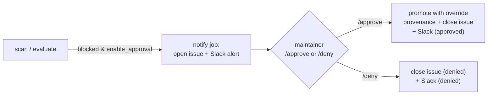

# Configuring human-in-the-loop promotion overrides + Slack notifications

This guide explains, from an operator's perspective, how to turn on the optional
**human-in-the-loop override approval** path for the promote-from-quarantine
workflows, and how to configure **Slack** so the team is notified when an image
is blocked, approved, or denied.

It is a practical, task-oriented companion to the
[promote-from-quarantine override-approval architecture](../../architecture/catalog/promote-from-quarantine-override-approval.md)
document and the [workflow actions reference](../../reference/workflow-actions.md).
If you only want to understand the design, read the architecture document; if
you want to *enable* or *operate* the override path, read this one.

## Contents

- [What the override path does](#what-the-override-path-does)
- [Prerequisites](#prerequisites)
- [Step 1 — Configure Slack](#step-1--configure-slack)
- [Step 2 — Add the repository secrets](#step-2--add-the-repository-secrets)
- [Step 3 — Enable approval on a workflow](#step-3--enable-approval-on-a-workflow)
- [Step 4 — Make sure the override caller is present](#step-4--make-sure-the-override-caller-is-present)
- [Using the approve / deny flow](#using-the-approve--deny-flow)
- [What happens on approve vs deny](#what-happens-on-approve-vs-deny)
- [Who is allowed to approve](#who-is-allowed-to-approve)
- [Troubleshooting](#troubleshooting)

## What the override path does

By default the promote-from-quarantine workflows are fully automated: an image
that fails the CVE gate is simply **left in quarantine**, with no notification
beyond the run summary.

When the override path is enabled, a blocked image instead triggers a
human-in-the-loop review:

1. The scan job records the blocked image's promotion parameters as a metadata
   artifact.
2. A dedicated, least-privilege `notify` job opens (or refreshes) a per-tag
   **tracking issue** labeled `promotion-pending` and posts a **Slack alert**.
3. A maintainer comments **`/approve`** or **`/deny`** on that issue (or runs the
   override workflow manually).
4. On approve, the image is promoted *despite* the failing gate and stamped with
   override-provenance annotations. On deny, the issue is closed and the image
   stays in quarantine.



## Prerequisites

- You can edit repository **secrets** (Settings → Secrets and variables →
  Actions) — that is, you are a repository administrator.
- You can create a **Slack incoming webhook** in the target workspace.
- The override actions and workflows are present in the repo (shipped together):
  `notify-slack`, `manage-issue`, `verify-approver`, the extended
  `attach-scan-report`, the extended `_promote-from-quarantine.yml` /
  `_promote-from-quarantine-sbom.yml`, and the `_promote-override.yml` /
  `promote-override.yml` pair.

## Step 1 — Configure Slack

The `notify-slack` action posts to a **Slack incoming webhook**. This is the only
Slack configuration required to receive notifications.

1. In Slack, go to <https://api.slack.com/apps> and **Create New App** →
   *From scratch*. Give it a name (e.g. `cssc-promotion-bot`) and pick the
   workspace.
2. Open **Incoming Webhooks** and toggle it **On**.
3. Click **Add New Webhook to Workspace**, choose the channel that should receive
   promotion alerts (e.g. `#supply-chain-alerts`), and **Allow**.
4. Copy the generated webhook URL. It looks like:

   ```text
   https://hooks.slack.com/services/<TEAM_ID>/<CHANNEL_ID>/<SECRET_TOKEN>
   ```

Treat this URL as a secret — anyone with it can post to your channel.

> **Optional — interacting from Slack.** The webhook above is enough to *receive*
> alerts. If you also want to *act* from Slack (open the tracking issue, comment
> `/approve` or `/deny` without leaving Slack), install the official
> [GitHub Slack app](https://github.com/integrations/slack) and subscribe the
> channel to this repository's issues. The approve/deny decision is still a
> regular issue comment, so the GitHub Slack app simply surfaces and forwards it.

## Step 2 — Add the repository secrets

Add the following secrets under **Settings → Secrets and variables → Actions**:

| Secret | Required for | Purpose | Scope / notes |
| ------ | ------------ | ------- | ------------- |
| `SLACK_WEBHOOK` | Notifications | Slack incoming webhook URL from Step 1. | If absent, `notify-slack` is a **no-op** (logs a warning) — the workflow still succeeds. |
| `GHCR_DELETE_TOKEN` | Promotion + cleanup | PAT with `delete:packages` used to remove the quarantine tag after a successful (override) promotion. | If absent, deletion is skipped; promotion still happens. |

`GHCR_DELETE_TOKEN` is the same secret the normal promote-from-quarantine
workflows already use; you only need to add `SLACK_WEBHOOK`.

## Step 3 — Enable approval on a workflow

Approval is **opt-in per image**. Edit the per-image caller (for example
[`promote-from-quarantine-python.yml`](../../../.github/workflows/promote-from-quarantine-python.yml))
and add `enable_approval: true` to its `with:` block plus the `slack_webhook`
secret:

```yaml
jobs:
  promote-from-quarantine-python:
    uses: ./.github/workflows/_promote-from-quarantine.yml
    with:
      source_repo: ghcr.io/toddysm/quarantine/python
      dest_repo: ghcr.io/toddysm/golden/python
      severity_threshold: ${{ github.event_name == 'workflow_dispatch' && inputs.severity_threshold || 'HIGH' }}
      cve_exceptions: ${{ github.event_name == 'workflow_dispatch' && inputs.cve_exceptions || '' }}
      dry_run: ${{ github.event_name == 'workflow_dispatch' && inputs.dry_run || false }}
      enable_approval: true            # <-- turn on the override path
    secrets:
      ghcr_delete_token: ${{ secrets.GHCR_DELETE_TOKEN }}
      slack_webhook: ${{ secrets.SLACK_WEBHOOK }}   # <-- pass the webhook through
```

The same change applies to SBOM-based callers that use
`_promote-from-quarantine-sbom.yml`.

Leaving `enable_approval` unset (or `false`) keeps the original automated
behavior — blocked images are left in quarantine with no issue or Slack message.

## Step 4 — Make sure the override caller is present

The approve/deny decision is handled by the
[`promote-override.yml`](../../../.github/workflows/promote-override.yml) caller,
which is repository-wide (not per image). It triggers on:

- **`issue_comment`** — a `/approve` or `/deny` comment on an open issue carrying
  the `promotion-pending` label, and
- **`workflow_dispatch`** — a manual run taking `issue_number` and `decision`.

No configuration is needed beyond the `SLACK_WEBHOOK` and `GHCR_DELETE_TOKEN`
secrets from Step 2. The `issue_comment` trigger always runs the workflow
definition from the **default branch**, so the parsing/promotion logic cannot be
tampered with from a fork or feature branch.

## Using the approve / deny flow

When an image is blocked and approval is enabled:

1. A tracking issue titled **`Promotion blocked: <image>:<tag>`** is opened (or
   refreshed) with the `promotion-pending` label. Its body contains a
   machine-readable metadata block that the override run reads back — **do not
   edit that block**.
2. A Slack message (`blocked-pending`) is posted with the image, tag, threshold,
   blocking CVEs, and links to the issue and the run.
3. A maintainer reviews and responds **on the tracking issue**:

   - Comment **`/approve`** to promote the image despite the failing gate.
   - Comment **`/deny`** to reject the promotion and close the issue.

   The command must be the first token of the comment. You can also run the
   `promote override` workflow manually (**Actions → promote override → Run
   workflow**) and supply the `issue_number` and `decision`.

## What happens on approve vs deny

**On `/approve`:**

- `verify-approver` confirms the commenter has sufficient repository permission.
- The image is mirrored from quarantine into the promotion target (force copy,
  preserving referrers for the SBOM path).
- `attach-scan-report` records override-provenance annotations on the scan-report
  referrer so the promotion is auditable:

  | Annotation | Example |
  | ---------- | ------- |
  | `com.cssc.scan.override` | `true` |
  | `com.cssc.scan.override-approver` | `octocat` |
  | `com.cssc.scan.override-issue` | `https://github.com/.../issues/42` |
  | `com.cssc.scan.override-cves` | `CVE-2024-1234\|CVE-2024-5678` |

- The quarantine tag is deleted (when `delete_source` is true and
  `GHCR_DELETE_TOKEN` is set).
- The issue is relabeled `promotion-approved`, a closing comment is posted, and
  the issue is closed. A Slack `approved` message is sent.

**On `/deny`:**

- No image is promoted.
- The issue is relabeled `promotion-denied`, a closing comment is posted, and the
  issue is closed. A Slack `denied` message is sent.

## Who is allowed to approve

Approvals are gated by the `verify-approver` action. By default it requires at
least **`maintain`** permission on the repository (`admin` ≥ `maintain` ≥
`write`); a commenter below the threshold is rejected and the override does not
proceed. The minimum can be tightened or relaxed via the `min_permission` input
on `_promote-override.yml` (`admin | maintain | write`).

## Troubleshooting

| Symptom | Likely cause | Fix |
| ------- | ------------ | --- |
| No Slack message on a blocked image | `SLACK_WEBHOOK` secret not set, or `slack_webhook` not passed in the caller | Add the secret (Step 2) and the `slack_webhook:` line (Step 3). The action no-ops with a warning when the webhook is empty. |
| No tracking issue opened | `enable_approval` not set on the caller | Set `enable_approval: true` (Step 3). |
| `/approve` did nothing | Comment isn't on an open `promotion-pending` issue, or the command wasn't the first token | Comment `/approve` (or `/deny`) as the first word on the tracking issue itself. |
| Override rejected as unauthorized | Commenter is below the `maintain` threshold | Have a maintainer/admin approve, or adjust `min_permission`. |
| Promotion happened but quarantine tag remains | `GHCR_DELETE_TOKEN` missing or lacks `delete:packages` | Add a PAT with `delete:packages` as `GHCR_DELETE_TOKEN`. |
| Override run can't find metadata | The metadata block in the issue body was edited | Re-run the scan to regenerate the issue, or dispatch the override against a freshly created issue. |
