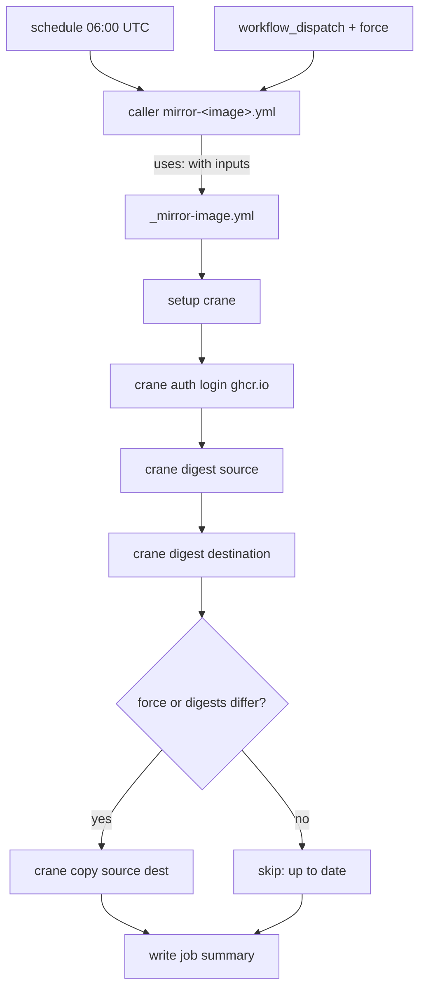

# Mirroring base images from Docker Hub to GHCR

This guide explains, from a user's perspective, how the **mirror** GitHub
Actions in this repository copy upstream container base images from Docker Hub
into the GitHub Container Registry (GHCR), and how to add a new mirror for an
additional image or tag.

It is a practical, task-oriented companion to the
[image mirror workflows architecture](../architecture/workflows/image-mirror-workflows.md)
document. If you only want to understand the design, read that document; if you
want to *operate* or *extend* the mirrors, read this one.

## Contents

- [What the mirror actions do](#what-the-mirror-actions-do)
- [The three existing actions](#the-three-existing-actions)
- [How a mirror run works, step by step](#how-a-mirror-run-works-step-by-step)
- [Running a mirror manually](#running-a-mirror-manually)
- [Reading the run summary](#reading-the-run-summary)
- [Adding a new mirror action](#adding-a-new-mirror-action)
- [Updating the tag of an existing mirror](#updating-the-tag-of-an-existing-mirror)
- [Troubleshooting](#troubleshooting)

## What the mirror actions do

Each mirror action keeps one upstream image tag fresh inside GHCR under a
`quarantine/<image>` repository. For example, the public `python:3.14-slim`
image on Docker Hub is mirrored to:

```text
ghcr.io/toddysm/quarantine/python:3.14-slim
```

The mirror is **idempotent**: every run compares the upstream digest with the
digest already in GHCR and copies only when they differ, so scheduled runs are
cheap when nothing has changed. Multi-architecture images keep all their
platforms because the copy is performed at the manifest-list level.

Mirrors run automatically on a daily schedule and can also be started manually.

## The three existing actions

There are currently three mirror actions, one per base image. Each is a thin
"caller" workflow that supplies image-specific values and delegates all logic to
the shared reusable workflow
[`_mirror-image.yml`](../../.github/workflows/_mirror-image.yml).

| Workflow file | Display name | Source (Docker Hub) | Destination (GHCR) |
| ------------- | ------------ | ------------------- | ------------------ |
| [`mirror-python.yml`](../../.github/workflows/mirror-python.yml) | `mirror / quarantine/python` | `docker.io/library/python:3.14-slim` | `ghcr.io/toddysm/quarantine/python:3.14-slim` |
| [`mirror-node.yml`](../../.github/workflows/mirror-node.yml) | `mirror / quarantine/node` | `docker.io/library/node:26-alpine` | `ghcr.io/toddysm/quarantine/node:26-alpine` |
| [`mirror-openjdk.yml`](../../.github/workflows/mirror-openjdk.yml) | `mirror / quarantine/openjdk` | `docker.io/library/openjdk:27-ea-slim` | `ghcr.io/toddysm/quarantine/openjdk:27-ea-slim` |

All three are structurally identical. They differ only in four input values
(`source_image`, `source_tag`, `dest_image`, `dest_tag`), their display `name:`,
and their `concurrency.group`. For example,
[`mirror-python.yml`](../../.github/workflows/mirror-python.yml) calls the
reusable workflow like this:

```yaml
jobs:
  mirror-python:
    uses: ./.github/workflows/_mirror-image.yml
    with:
      source_image: docker.io/library/python
      source_tag: 3.14-slim
      dest_image: ghcr.io/toddysm/quarantine/python
      dest_tag: 3.14-slim
      force: ${{ github.event_name == 'workflow_dispatch' && inputs.force || false }}
```

### Triggers

Every mirror action has two triggers:

- **`schedule`** — a daily cron at `06:00 UTC` that checks upstream for changes.
- **`workflow_dispatch`** — a manual run from the Actions tab, with an optional
  `force` checkbox to copy even when the digests already match.

### Concurrency

Each action uses a per-image concurrency group (for example
`mirror-quarantine-python`) with `cancel-in-progress: false`. This ensures two
runs of the *same* image never overlap, while different images can mirror at the
same time.

### Permissions

Each action runs with the least privileges it needs:

```yaml
permissions:
  contents: read
  packages: write
```

Authentication to GHCR uses the built-in `GITHUB_TOKEN` — there are no
long-lived registry secrets to manage. The public Docker Hub source is pulled
anonymously.

## How a mirror run works, step by step

Whether triggered by the schedule or manually, a run performs these steps inside
the reusable workflow:

1. **Set up `crane`** — installs the [`crane`](https://github.com/google/go-containerregistry/blob/main/cmd/crane/README.md)
   CLI via the SHA-pinned `imjasonh/setup-crane` action.
2. **Log in to GHCR** — authenticates to `ghcr.io` with the `GITHUB_TOKEN`.
3. **Compare digests and copy if changed:**
   - Reads the source digest with `crane digest <source>`.
   - Reads the destination digest (a missing destination is treated as empty).
   - If `force` is not set and the digests match, it logs "already up to date"
     and exits without copying.
   - Otherwise it runs `crane copy <source> <destination>`, preserving the
     multi-architecture manifest list, and reports the new digest.
4. **Write a run summary** to the GitHub Actions job summary describing whether
   the image was up to date or copied, with the relevant digests.



## Running a mirror manually

1. Open the **Actions** tab of the repository on GitHub.
2. In the left sidebar, select the mirror workflow you want, for example
   **`mirror / quarantine/python`**.
3. Click **Run workflow**.
4. Choose the branch (normally `main`).
5. Optionally check **force** to copy even when the source and destination
   digests already match (useful for re-seeding a destination or recovering
   after a deletion).
6. Click **Run workflow** to start the run.

To trigger the same run from the command line with the GitHub CLI:

```bash
# Normal manual run
gh workflow run mirror-python.yml

# Force copy even if digests match
gh workflow run mirror-python.yml -f force=true
```

## Reading the run summary

Each run writes a Markdown summary visible on the run's page. There are two
possible outcomes:

- **Up to date** — the source and destination digests matched (and `force` was
  not set), so nothing was copied. The summary lists the source, destination,
  and shared digest.
- **Copied** — the image was copied. The summary lists the source, destination,
  the previous destination digest (or `<none>` if the destination did not exist
  yet), and the new digest.

## Adding a new mirror action

Adding a mirror for a new image (or a different tag of an existing image) is a
copy-and-edit task — you never need to touch the reusable workflow.

### 1. Choose the source and destination

Decide on:

- **Source image and tag** on Docker Hub, e.g. `docker.io/library/golang` and
  `1.24-alpine`.
- **Destination image and tag** in GHCR under the `quarantine/<image>` scheme,
  e.g. `ghcr.io/toddysm/quarantine/golang` and `1.24-alpine`.

> Official Docker Hub images live under the `library/` namespace
> (`docker.io/library/<image>`). Non-official images use their owner namespace
> (`docker.io/<owner>/<image>`).

### 2. Create the caller workflow

Copy an existing caller, for example
[`mirror-python.yml`](../../.github/workflows/mirror-python.yml), to a new file
named `mirror-<image>.yml`. Following the
[workflow naming conventions](../contributing/workflow-naming.md), the filename
must start with the `mirror-` prefix.

Create `.github/workflows/mirror-golang.yml`:

```yaml
# Mirror golang:1.24-alpine from Docker Hub into GHCR as quarantine/golang.
#
# This caller only defines triggers and the image-specific inputs; the actual
# digest-check-and-copy logic lives in the reusable _mirror-image.yml workflow.
name: mirror / quarantine/golang

on:
  # Daily upstream check at 06:00 UTC.
  schedule:
    - cron: "0 6 * * *"
  # Manual run, with an optional force copy.
  workflow_dispatch:
    inputs:
      force:
        description: "Copy even when the source and destination digests match."
        required: false
        default: false
        type: boolean

# Avoid overlapping runs for this specific image mirror.
concurrency:
  group: mirror-quarantine-golang
  cancel-in-progress: false

permissions:
  contents: read
  packages: write

jobs:
  mirror-golang:
    uses: ./.github/workflows/_mirror-image.yml
    with:
      source_image: docker.io/library/golang
      source_tag: 1.24-alpine
      dest_image: ghcr.io/toddysm/quarantine/golang
      dest_tag: 1.24-alpine
      force: ${{ github.event_name == 'workflow_dispatch' && inputs.force || false }}
```

### 3. Update the image-specific values

When adapting the copied file, change all of the following so they match the new
image — leaving any of them pointing at the old image is the most common
mistake:

| What to change | Example |
| -------------- | ------- |
| Display `name:` | `mirror / quarantine/golang` |
| `concurrency.group` | `mirror-quarantine-golang` |
| Job key (`jobs.<key>`) | `mirror-golang` |
| `source_image` | `docker.io/library/golang` |
| `source_tag` | `1.24-alpine` |
| `dest_image` | `ghcr.io/toddysm/quarantine/golang` |
| `dest_tag` | `1.24-alpine` |
| The header comment | description of the new image |

You do **not** need to change the triggers, permissions, or the `uses:` line —
the reusable workflow does all the work.

### 4. Open a pull request and merge

Commit the new file on a branch and open a pull request. Once it is merged to
`main`:

- The new mirror will run automatically at the next daily schedule.
- You can trigger it immediately from the **Actions** tab or with
  `gh workflow run mirror-golang.yml`. Because the destination does not exist
  yet, the first run will always copy the image.

### 5. Verify the first run

After the first run completes, confirm the image is present:

```bash
crane digest ghcr.io/toddysm/quarantine/golang:1.24-alpine
```

The package will also appear under the repository owner's **Packages** with the
name `quarantine/golang`.

## Updating the tag of an existing mirror

To mirror a different tag of an image that already has a mirror (for example
bumping Python from `3.14-slim` to a newer tag), edit the existing
`mirror-<image>.yml` and update `source_tag` and `dest_tag` (and the display
`name:`/comment if you reference the version there). Open a pull request as
usual.

> Mirrors track exactly one explicitly pinned tag each. There is no automatic
> discovery of new tags, and old tags are never pruned from GHCR — changing the
> tag simply starts mirroring the new one; the previously mirrored tag remains
> in GHCR until removed manually.

## Troubleshooting

| Symptom | Likely cause and fix |
| ------- | -------------------- |
| Run fails at **Log in to GHCR** | The workflow is missing `packages: write` permission, or it was run from a fork without access to `GITHUB_TOKEN`. Run it from a branch in this repository. |
| Run fails at **Compare digests** reading the source | The `source_image`/`source_tag` is wrong or the tag no longer exists on Docker Hub. Verify with `crane digest docker.io/library/<image>:<tag>`. |
| Manual run copies nothing but you expected an update | The digests already match. Re-run with **force** enabled to copy regardless. |
| New mirror never runs automatically | Confirm the file was merged to `main` and the filename starts with `mirror-`. Scheduled workflows run only from the default branch. |
| Two runs seem to clash | They should not — the per-image `concurrency.group` serializes runs of the same image. Ensure the group is unique per image. |
